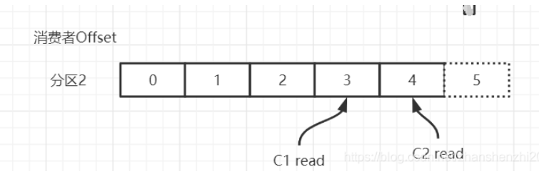
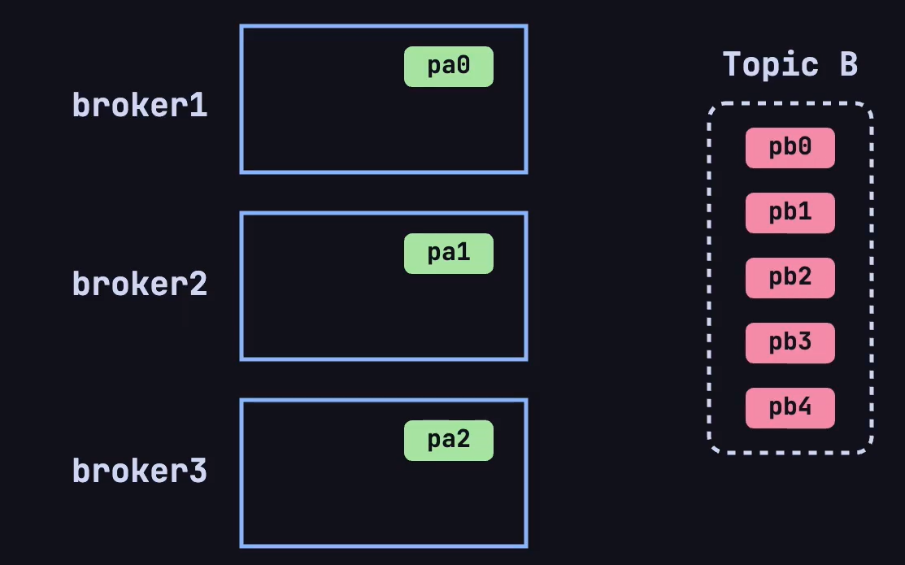
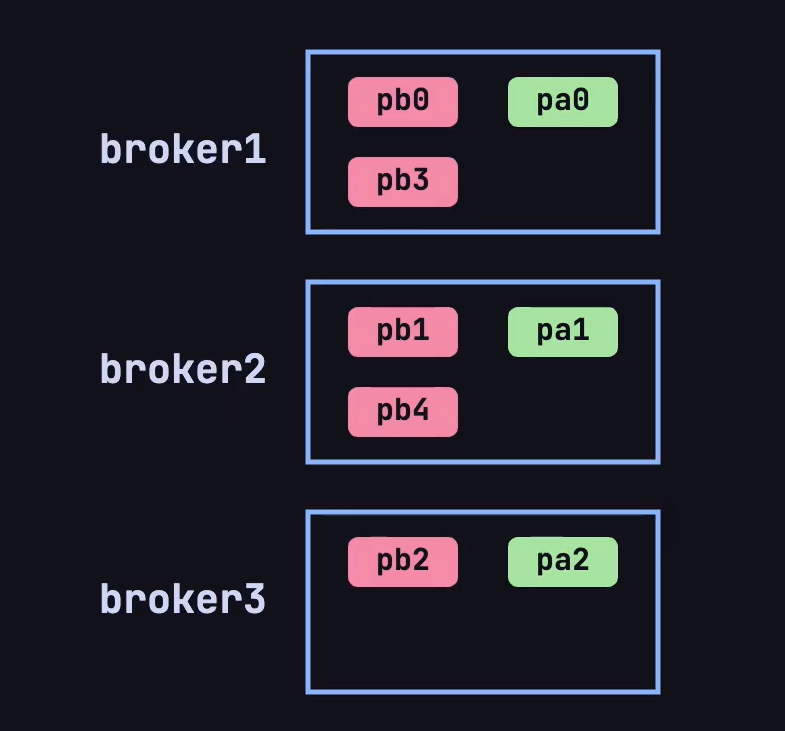
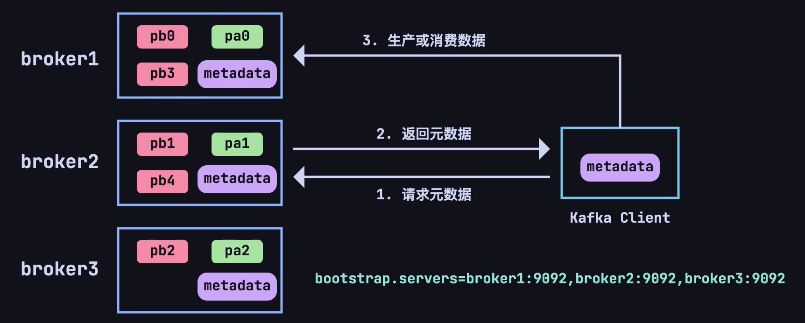
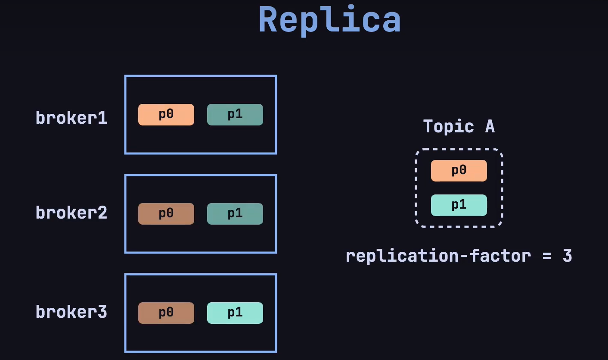
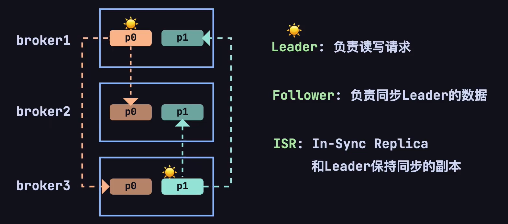

# Kafka

::: details 参考资料如下：
- [千锋教育最新kafka入门到精通教程](https://www.bilibili.com/video/BV1Xy4y1G7zA)
- [windows系统kafka小白入门篇](https://blog.csdn.net/m0_70325779/article/details/137248462)
:::

## 1.基本介绍

[Kafka](https://kafka.apache.org/)，本质是一个高性能、高吞吐量（kafka 集群，3节点 16C32G 的 tps 可达 18W，3 分区 1 副本，亲测）、低延迟、高并发的消息队列，多用于业务的拆分解耦。 

- 订单业务拆分
- 日志收集
- 数据流管道处理

### 1.1.概念

之前已经介绍过了消息队列的流派，Kafka 是有 broker 的重 topic 流派，在 Kafka 中有以下的概念，需要知道：

| 名称               | 含义                                                                                                                                  |
|------------------|-------------------------------------------------------------------------------------------------------------------------------------|
| `broker`         | 一个kafka节点就是一个broker，broker 负责接收、存储和发送消息，并协调集群中的其他 broker 和管理分区的副本                                                                   |
| `topic`          | 主题，可以理解成队列，producer在向kafka发送消息时，必须携带topic一个 topic 可以分为多个分区，每个分区可能分布在不同的 broker 上。消费者会根据 topic 订阅并消费消息                               |
| `producer`       | 生产者将消息发送到特定的 topic 中                                                                                                                |
| `consumer`       | 消费者，从 Kafka 的 topic 中消费消息。消费者可以独立工作，也可以加入一个消费组，共同消费某个 topic 的消息。                                                                    |
| `consumer group` | 消费组，多个消费者可以组成一个消费组来消费同一 topic 的消息。Kafka 确保每条消息只会被消费组中的一个消费者消费，这种机制允许多个消费者同时消费大量数据，同时避免重复消费。                                         |
| `offset`         | 偏移量，Kafka 中的每条消息在分区中都有一个唯一的偏移量。消费者在消费消息时，会记录自己当前的消费偏移量，下一次消费时从这个偏移量开始。offset 用来跟踪消息的顺序和进度。                                          |
| `partition`      | 分区是 Kafka 中的物理存储单元。每个 topic 可以分为多个分区，每个分区中的消息是有序的。分区分布在不同的 broker 上，以实现负载均衡和并行处理。                                                   |
| `replica`        | 副本，Kafka 为每个分区维护多个副本，以确保高可用性和数据冗余。每个分区的主副本（leader）负责读写操作，其他副本（follower）只负责同步数据。当 leader 副本发生故障时，Kafka 会自动选择一个 follower 成为新的 leader。 |


::: warning
第一章的以下内容，小白按需观看，先不用着急看，属于比较高阶。学习前，最好已经使用过 Kafka，有了基础认知。
:::

### 1.2.offset

**生产者Offset**，生产者发送一条消息到 Kafka 的 broker 的某个 topic 下的某个 partition 中，Kafka 内部会为每条消息分配一个唯一的 offset，该 offset 就是该消息在这个 partition 中的位置。


**消费者Offset**，消费者需要知道自己已经读取到了哪个位置。每个消费组（consumer group）中的消费者会独立地维护自己的 offset，当消费者从某个 partition 读取消息时，它会记录当前读取到的 offset。这样，及时消费者崩溃或者重启，还可以从上次读取到的位置继续消费，不会重复读取或者遗漏消息。（消费者offset需要消费消息并且提交后才会记录offset）



### 1.3.partition

Topic 是一个逻辑概念，Partition 是最小的存储单元，掌握着一个 Topic 的部分数据。

一个 topic 可以被分为若干个`分区`（partition），同一个主题中的不同分区可以不在一个机器上，也有可能会部署在同一个机器上。

在 producer 将 msg 发送给 broker 时，会根据分区规则，选择性的将消息存储到特定的分区中，只要分区规则设置的合理，那么所有的消息就会被均匀的分布到不同的分区中，这样就实现了**负载均衡**、**水平扩展**和**并行消费**。

另外，多个consumer订阅一个分区中消息去消费，可以提高吞吐量 🤠。并且，msg 是追加的方式写入到分区中的，顺序写磁盘的总效率比随机写内存的效率还要高，这也是 Kafka 高吞吐量的重要保证之一。

### 1.4.broker

在 Kafka 中， **Broker** 是 Kafka 集群中的一个节点，负责处理客户端的请求（生产者、消费者）、存储数据（消息）、以及进行消息复制（副本同步）。每个 broker 都是 Kafka 集群中的独立服务器。

一个 Kafka 集群可以包含一个或多个 broker，它们共同分担 Kafka 的数据存储和处理负载。生产者将消息发送到 broker，消费者从 broker 拉取消息。

**Broker ID** 是 Kafka 集群中每个 broker 的唯一标识符（通常是一个整数）。它用来区分不同的 broker 节点。
- 在 Kafka 集群中，每个 broker 必须有一个唯一的 broker ID，集群内的其他 broker 和控制器通过这个 ID 来识别该 broker。
- 当 Kafka 启动时，broker ID 会被指定（通常是在 `server.properties` 配置文件中设置）。比如：
  ```properties
  broker.id=1
  ```
- Broker ID 也被用来管理 topic 的分区副本。例如，一个 topic 分区的副本可能会分布在不同的 broker 上，每个副本会记录在哪个 broker（由 broker ID 表示）。

假设现在 kafka 的集群上有 3 个 broker，现在创建了一个 Topic A 有 3 个分区、Topic B 有 5 个分区：



根据 Kafka 的默认分区规则，会按照下图方式将两个topic的不同分区这样放在broker上：



现在又有一个新的问题了，每个主题的分区会分布在不同的 broker 上，当客户端连接到任意一台服务器，怎么知道这个主题的分区具体在哪台 broker 上呢❓❓❓

这就又引出了一个新概念，在每个 broker 上都会存放**元数据**（metadata），用于了解集群中所有的 topic、分区、副本及其他 broker 的状态。这份元数据使得每个 broker 可以知道哪些 broker 存储了哪些分区的副本，哪些分区的 leader 在哪个 broker 上，以及它自己是否是某些分区的 leader。

produce/consumer 只要能连接上任意一台 broker ，就可以获取整个集群中的所有信息。



Kafka 的客户端（包括生产者和消费者）在连接集群时会与任意一个 broker 建立长连接，并通过这个连接获取元数据信息。具体流程如下：
- 当 Kafka 的生产者或消费者启动时，它们会连接到 Kafka 集群中的一个 broker，通常称为 `bootstrap broker`。
- 客户端连接上 broker 后，会向这个 broker 请求集群的**元数据**。这个 broker 会将最新的元数据返回给客户端，无论客户端最初连接的 broker 是否是某个分区的 leader。元数据包含以下内容：
    - 所有 broker 的列表及其 ID 和地址。
    - 所有 topic 和分区的信息。
    - 每个分区的 leader 和副本所在的 broker。
- 客户端在收到元数据后，会将这份数据**缓存**下来，利用这份缓存的数据来决定与哪个 broker 通信，减少频繁的元数据请求开销。
  - **生产者** 在发送消息时可以直接将消息发送到某个分区的 leader broker。
  - **消费者** 可以根据元数据中的 leader 信息，直接从分区的 leader broker 拉取消息。

如果元数据失效or更新了，客户端怎么办❓❓❓
- Kafka 的客户端与 broker 通常是通过 **长连接**（持久 TCP 连接）进行通信的。客户端在启动后会保持与 broker 的连接，并定期通过心跳机制来维持连接的状态，只需要重新发送请求就可以得知。

**简化的工作流程示意图**：
1. **客户端启动** -> 连接到 **任意 broker** -> 请求 **元数据**。
2. **客户端缓存元数据**。
3. **生产者** 根据元数据决定消息发送到哪个分区、哪个 broker。
4. **消费者** 根据元数据决定从哪个分区、哪个 broker 拉取消息。
5. **元数据失效**时，客户端会重新向 Kafka 集群请求最新的元数据。

### 1.5.replica

还有个新的问题是，如果集群中的某一台 broker 发生故障了，怎么办❓❓❓

这就是 `replica` 机制，在创建 topic 的时候，指定 `replica-factor` 副本因子，确定副本的数量：



在 Kafka 中，每个分区（partition）都独立拥有一个 leader。如果一个 topic 有多个分区，那么每个分区都会有一个 leader 来处理该分区的数据读写操作，follower 用于同步 leader 的数据。



即使，其中一个 broker 宕机了，仍然可以通过副本供客户端访问。会重新选举出一个 leader，用于处理该分区的读写操作。

## 2.安装

为了便于学习，将在 windows 环境下安装 kafka，安装的版本为 [kafka_2.13-3.8.0.tgz](https://kafka.apache.org/downloads) ，含义是 scala 语言版本为 2.13，对应的 Kafka 版本是3.8.0。

### 2.1.下载解压
下载解压，由于是 tgz 文件，采用 powershell ，进入下载文件存放的目录，输入：

```shell
# 解压的目录，输入命令
tar -zxvf .\kafka_2.13-3.8.0.tgz
```

就可以解压文件：


然后在你解压完文件的目录下，创建 `logs` 文件夹用于存放日志文件，创建 `data` 文件夹用于存放数据。


### 2.2.修改zk配置文件

进入 config 目录下，找到 `zookeeper.properties` 文件，配置存储路径：

```properties
dataDir=D:/apps/kafka_2.13-3.8.0/data
```

### 2.3.修改kafka配置文件

进入 config 目录下，找到 `server.properties` 文件，配置存储路径：

```properties
log.dirs=D:/apps/kafka_2.13-3.8.0/logs
```

### 2.4.创建zk启动脚本

在解压后的目录下，创建一个记事本，记事本中加入：

```text
call bin/windows/zookeeper-server-start.bat config/zookeeper.properties
```

重命名为 `zk.cmd`

### 2.5.创建kafka启动脚本

在解压后的目录下，创建一个记事本，记事本中加入：

```text
call bin/windows/kafka-server-start.bat config/server.properties
```

重命名为 `kafka.cmd`，至此，我们的解压后的目录多了两个文件夹和两个脚本文件：


### 2.6.启动

在启动的时候，必须先启动双击 `zk.cmd` 启动 zookeeper，再双击 `kafka.cmd` 启动 kafka；关闭的时候，需要先关闭 kafka，再关闭 zookeeper 。

### 2.7.kafka客户端

有一个 GUI 可以可视化看到 kafka 中的数据，比较方便学习，我所使用的是：[Kafka-King](https://github.com/Bronya0/Kafka-King?tab=readme-ov-file)，下载后配置使用即可。


## 3.使用

在日常使用 Kafka ，首先应该是使用命令行 or GUI 客户端工具创建 topic ，指定分区和副本。在使用 Kafka 创建 topic 时，指定分区（partition）和副本（replica）的数量需要根据 Kafka 集群的 broker 数量来规划和配置。

建议创建 topic 前，考虑集群中 broker 数量和业务需求，按实考量 🌶️。

命令行创建：

```shell
# 创建名为 test 的topic，分区 1，副本 1
kafka-topics.sh --create --topic test --partitions 1 --replication-factor 1 --bootstrap-server <broker_host>:<port>
```

直接使用 Kafka King 创建就简单多了，大部分在公司工作的时候，都是使用客户端工具去操作就行了。万一，如果让你在linux上操作，那就现学现搜就行。

本地使用 Kafka King 真的挺不错的，各种功能都有 😄。如果是大型集群，建议使用：[Know Streaming](https://github.com/didi/KnowStreaming)，可以观察流量，Kafka中的数据积压。

在开发时候，需要关注的 `consumer group` 中的三个信息：
- current-offset：最后被消费的消息的偏移量
- log-end-offset：消息总量（最后一条消息的偏移量）
- lag：积压消息总量

## 4.Java

终于进入正式篇了✌，从 Java 的角度来看 Kafka 有两个维度：
- producer：编写Java代码，朝 topic 中发送消息
- consumer：消费 topic 中的消息

### 4.1.环境搭建

现代开发，都是基于 SpringBoot 作为框架去迅速开发，首先进行环境搭建，引入 kafka 的依赖：

```xml
<!--kafka-->
<dependency>
    <groupId>org.springframework.kafka</groupId>
    <artifactId>spring-kafka</artifactId>
</dependency>
```

编写配置文件 `application.yml` :

```yml
server:
  port: 3489

spring:
  kafka:
    bootstrap-servers: localhost:9092
    producer:
      key-serializer: org.apache.kafka.common.serialization.StringSerializer
      value-serializer: org.apache.kafka.common.serialization.StringSerializer
    consumer:
      key-deserializer: org.apache.kafka.common.serialization.StringDeserializer
      value-deserializer: org.apache.kafka.common.serialization.StringDeserializer
```

编写一个 controller 用于接受 mock 的请求：

```java:line-numbers
@RestController
@RequestMapping("/kafka")
public class TestController {

    @PostMapping("/send")
    public String send(@RequestParam("msg") String msg) {
        return "success";
    }

    @GetMapping("/consume")
    public String consume() {
        return "success";
    }
}
```

编写一个 service 用于和 Kafka 交互：

```java:line-numbers
@Service
public class TestService {

    // 注入kafka-client，key和value的序列化方式都是String
    @Autowired
    private KafkaTemplate<String, String> kafkaTemplate;

}
```

### 4.1.生产消息

基于 SpingBoot ，编写代码，朝刚刚创建的名为 test 的topic发送消息。在日常的开发中，其实很简单，

