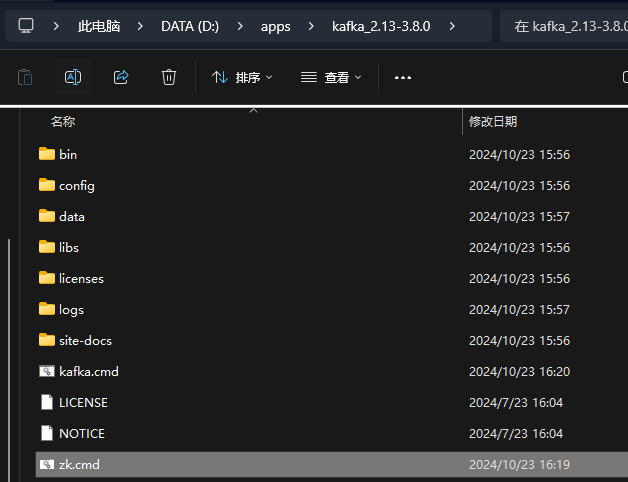

# Kafka

> [!TIP]
> 参考资料如下：
> - [千锋教育最新kafka入门到精通教程](https://www.bilibili.com/video/BV1Xy4y1G7zA)
> - [windows系统kafka小白入门篇](https://blog.csdn.net/m0_70325779/article/details/137248462)

## 1.基本介绍

[Kafka](https://kafka.apache.org/)，本质是一个高性能、高吞吐量（kafka 集群，3节点 16C32G 的 tps 可达 18W，3 分区 1 副本，亲测）、低延迟、高并发的消息队列，多用于业务的拆分解耦。 

- 订单业务拆分
- 日志收集
- 数据流管道处理


## 2.安装

为了便于学习，将在 windows 环境下安装 kafka，安装的版本为 [kafka_2.13-3.8.0.tgz](https://kafka.apache.org/downloads) ，含义是 scala 语言版本为 2.13，对应的 Kafka 版本是3.8.0。

### 2.1.下载解压
下载解压，由于是 tgz 文件，采用 powershell ，进入下载文件存放的目录，输入：

```shell
# 解压的目录，输入命令
tar -zxvf .\kafka_2.13-3.8.0.tgz
```

就可以解压文件：


然后在你解压完文件的目录下，创建 `logs` 文件夹用于存放日志文件，创建 `data` 文件夹用于存放数据。


### 2.2.修改zk配置文件

进入 config 目录下，找到 `zookeeper.properties` 文件，配置存储路径：

```properties
dataDir=D:/apps/kafka_2.13-3.8.0/data
```

### 2.3.修改kafka配置文件

进入 config 目录下，找到 `server.properties` 文件，配置存储路径：

```properties
log.dirs=D:/apps/kafka_2.13-3.8.0/logs
```

### 2.4.创建zk启动脚本

在解压后的目录下，创建一个记事本，记事本中加入：

```text
call bin/windows/zookeeper-server-start.bat config/zookeeper.properties
```

重命名为 `zk.cmd`

### 2.5.创建kafka启动脚本

在解压后的目录下，创建一个记事本，记事本中加入：

```text
call bin/windows/kafka-server-start.bat config/server.properties
```

重命名为 `kafka.cmd`，至此，我们的解压后的目录多了两个文件夹和两个脚本文件：



### 2.6.启动

在启动的时候，必须先启动双击 `zk.cmd` 启动 zookeeper，再双击 `kafka.cmd` 启动 kafka；关闭的时候，需要先关闭 kafka，再关闭 zookeeper 。

### 2.7.kafka客户端

有一个 GUI 可以可视化看到 kafka 中的数据，比较方便学习，我所使用的是：[Kafka-King](https://github.com/Bronya0/Kafka-King?tab=readme-ov-file)，下载后配置使用即可。

## 3.