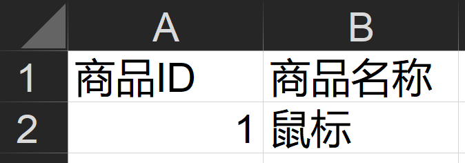
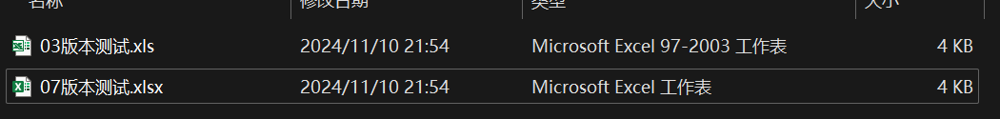

# EasyExcel

::: details 学习参考资料：

- [POI&EasyExcel报表数据库读写技术](https://www.bilibili.com/video/BV1cG411M7ut)
  :::

## 1.POI

### 1.1.介绍

[Apache POI](https://poi.apache.org/index.html) 是一个开源的 Java 库，用于读写 Microsoft Office 文件，尤其是 Excel、Word 和
PowerPoint 文件。它为开发者提供了处理
Microsoft Office 格式文件的 API，是 Java 中最常用的 Office 文件处理工具之一。以下是它的一些核心模块和功能：

- **Excel 文件处理 (HSSF 和 XSSF)**：
    - HSSF (Horrible Spreadsheet Format)：用于处理 Excel 97-2003 文件格式（即 `.xls`）。
    - XSSF (XML Spreadsheet Format)：用于处理 Excel 2007 及以上版本的文件格式（即 `.xlsx`）。
    - SXSSF (Streaming Usermodel API)：用于高效地处理非常大的 `.xlsx` 文件，避免内存溢出。

- **Word 文件处理 (HWPF 和 XWPF)**：
    - HWPF：用于处理 Word 97-2003 文件格式（即 `.doc`）。
    - XWPF：用于处理 Word 2007 及以上版本的文件格式（即 `.docx`）。

- **PowerPoint 文件处理 (HSLF 和 XSLF)**：
    - HSLF：用于处理 PowerPoint 97-2003 文件格式（即 `.ppt`）。
    - XSLF：用于处理 PowerPoint 2007 及以上版本的文件格式（即 `.pptx`）。

- **其他文件类型**：
    - 提供了一些支持处理图形、超链接、批注等其他内容的 API，适用于复杂的 Office 文档场景。

Apache POI 的常用场景包括自动生成和读取 Excel 报表、生成批量 Word 文档、处理 PowerPoint 幻灯片等。在企业应用中，它常用于生成动态报表、数据导出功能等。

### 1.2.存在的问题

Java 解析、生成 Excel 比较有名的框架为 POI、JXL ，都存在一个严重的问题是**损耗内存**，数据量比较大时有可能会出现 OOM 问题。

### 1.3.Excel03VS07

Excel 2003 和 Excel 2007 的区别主要体现在文件格式、界面、功能和性能上。以下是主要区别：

- 文件格式
    - **Excel 2003**：默认使用 `.xls` 格式（基于二进制的文件格式）。
    - **Excel 2007**：默认使用 `.xlsx` 格式（基于 Open XML 的文件格式），文件体积更小，兼容性更强，并且损坏文件后更易恢复。
- 最大行列数
    - **Excel 2003**：最大支持 65,536 行和 256 列。
    - **Excel 2007**：最大支持 1,048,576 行和 16,384 列，大大提高了数据处理的容量。
- 界面
    - **Excel 2003**：传统的菜单和工具栏界面。
    - **Excel 2007**：采用了“Ribbon”功能区界面，分类更清晰，操作更直观。
- 新增功能
    - **条件格式**：Excel 2007 中的条件格式功能更强大，支持更多规则和渐变颜色。
    - **图表类型**：Excel 2007 增加了更多的图表类型和样式，图表显示效果更好。
    - **数据透视表**：Excel 2007 对数据透视表进行了优化，支持更多的数据源和更强大的分析功能。
    - **公式**：Excel 2007 引入了更多新公式，并且对公式编写界面进行了改进。
- 文件大小和性能
    - **Excel 2003**：文件较大，复杂表格的处理速度较慢。
    - **Excel 2007**：新的 `.xlsx` 格式文件大小更小，压缩更高效，且处理大文件时性能更佳。
- 兼容性
    - **Excel 2003**：无法直接打开 `.xlsx` 文件，需要安装兼容包才能支持新格式。
    - **Excel 2007**：可以兼容 `.xls` 格式文件，但保存为 `.xls` 时某些功能可能不兼容。

总体来看，Excel 2007 相比 Excel 2003 在数据处理能力、界面设计、功能拓展和兼容性上有了显著提升。

### 1.4.具体操作

针对不同版本的 excel ，需要引入的 poi 依赖不同：

```xml
<!--03-->
<dependency>
    <groupId>org.apache.poi</groupId>
    <artifactId>poi</artifactId>
    <version>4.1.2</version>
</dependency>
```

```xml
<!--07-->
<dependency>
    <groupId>org.apache.poi</groupId>
    <artifactId>poi-ooxml</artifactId>
    <version>4.1.2</version>
</dependency>
```

在开始操作之前，需要先了解一些关于excel的基础概念：

- 工作簿：workbook 接口（整个的 excel 表格）
    - HSSFWorkbook，03版本
    - XSSFWorkbook，07版本
- 工作表：sheet
- 行：row
- 列（单元格）：cell

#### 1.4.1.单个数据写入

excel03版本写入，其实很简单，具体用到的代码如下：

```java:line-numbers
    /**
     * excel 03 版本写入数据
     */
    @Test
    public void write03() throws Exception {
        // 创建工作簿
        HSSFWorkbook workbook = new HSSFWorkbook();
        // 工作表
        Sheet sheet = workbook.createSheet("03版本sheet1");
        // 行
        Row row = sheet.createRow(0);
        // 单元格
        row.createCell(0).setCellValue("商品ID");
        row.createCell(1).setCellValue("商品名称");
        // 写入数据
        Row row1 = sheet.createRow(1);
        row1.createCell(0).setCellValue(1);
        row1.createCell(1).setCellValue("鼠标");
        // 写入具体的路径（xls）
        OutputStream outputStream = new FileOutputStream("E:\\codesDir\\data\\03版本测试.xls");
        workbook.write(outputStream);
        // 关闭流
        outputStream.close();
        log.info("03版本的表格生成完毕");
    }
```

03版本写入结果为：



07版本的excel写入更简单，只需要换对应的 api 即可完成：

```java:line-numbers
    /**
     * excel 07 版本写入数据
     */
    @Test
    public void write07() throws Exception {
        // 创建工作簿
        XSSFWorkbook workbook = new XSSFWorkbook();
        // 工作表
        Sheet sheet = workbook.createSheet("07版本sheet1");
        // 行
        Row row = sheet.createRow(0);
        // 单元格
        row.createCell(0).setCellValue("商品ID");
        row.createCell(1).setCellValue("商品名称");
        // 写入数据
        Row row1 = sheet.createRow(1);
        row1.createCell(0).setCellValue(1);
        row1.createCell(1).setCellValue("鼠标");
        // 写入具体的路径（xlsx）
        OutputStream outputStream = new FileOutputStream("E:\\codesDir\\data\\07版本测试.xlsx");
        workbook.write(outputStream);
        // 关闭流
        outputStream.close();
        log.info("07版本的表格生成完毕");
    }
```

最终执行完毕的结果：


#### 1.4.2.批量写入

前面就是简单的介绍了，如何使用各种 api 完成表格的写入，实际的业务场景为数据量很大时将数据写入到 excel 表格中。

03和07版本的excel对大数据量下的写入处理逻辑是完全不同的：

- 03版本的HSSF：
    - 最多支持65,536行数据的写入，超出会抛出异常
    - 先将所有的数据放入到缓存中，最后一次性写入磁盘，写入速度快
- 07+版本的XSSF：
    - 可以写较多的数据，最大支持 1,048,576 行和 16,384 列
    - 数据写入速度可能比较慢，获取全部行的数据，会消耗大量内存，数据量庞大会报OOM

