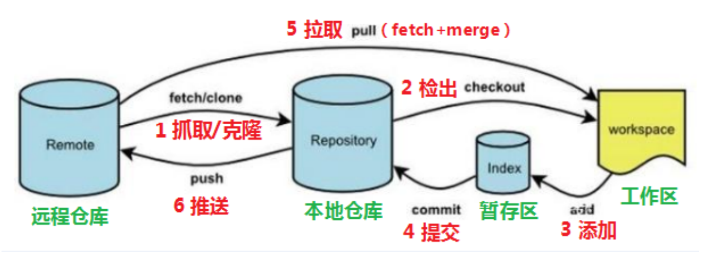
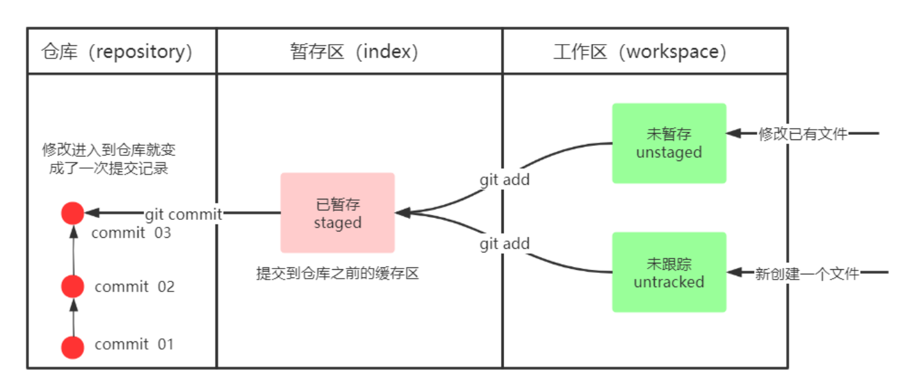
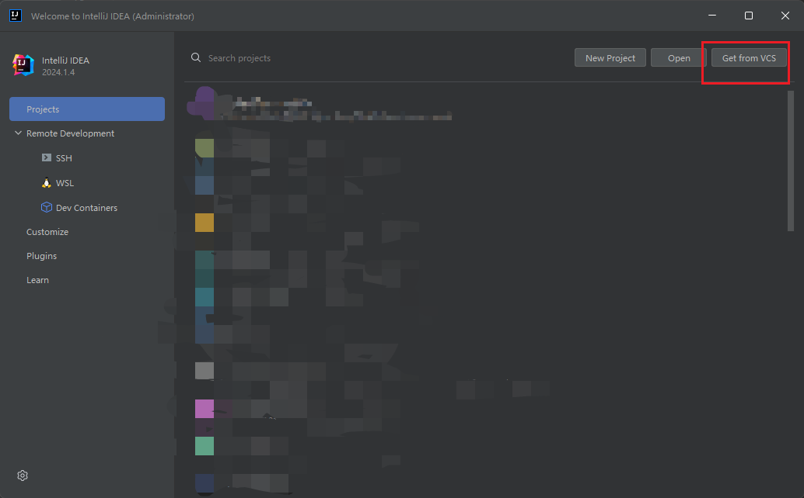
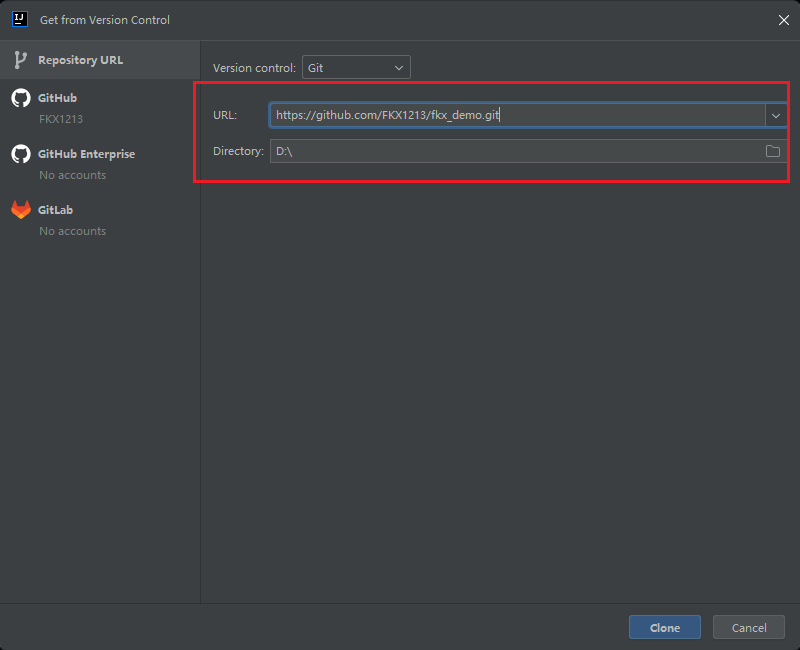
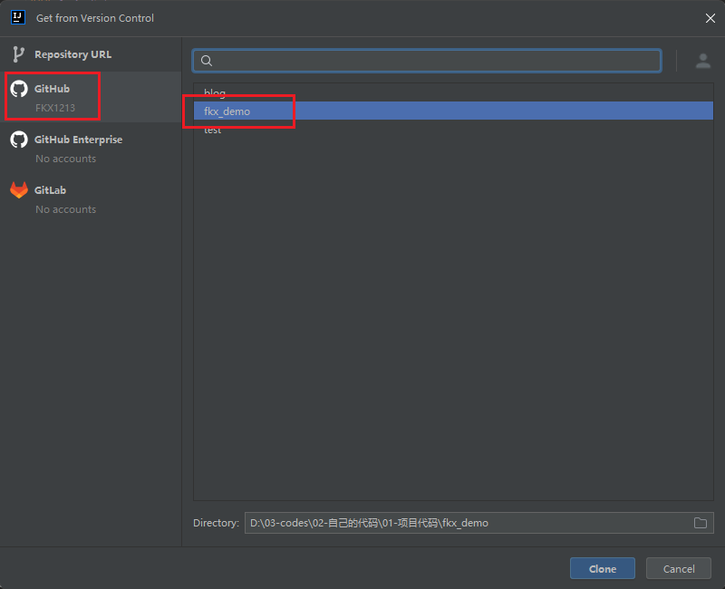
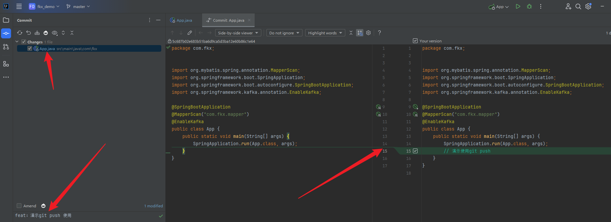
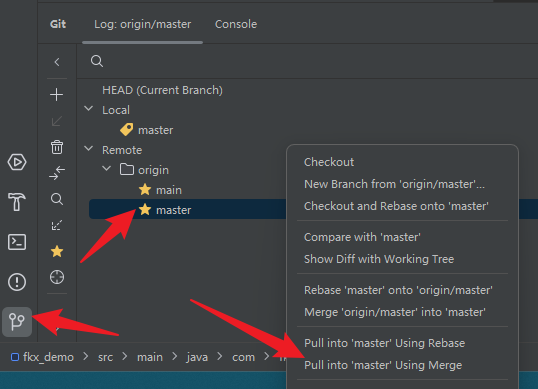
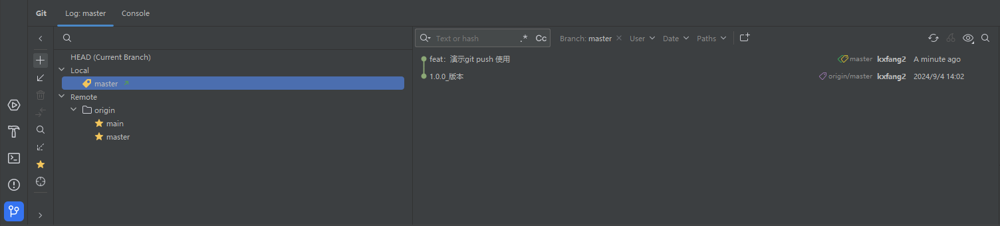
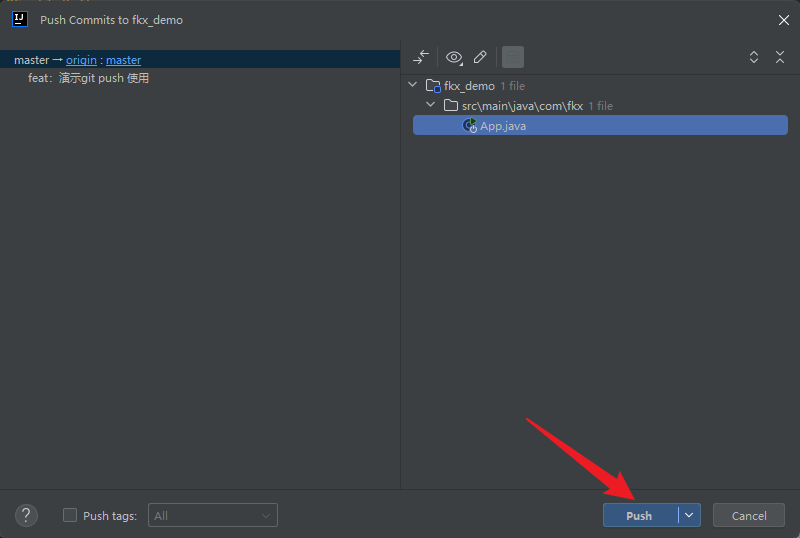

# Git

::: details 学习参考资料：

- [黑马程序员Git全套教程，完整的git项目管理工具教程](https://www.bilibili.com/video/BV1MU4y1Y7h5)
  :::

## 1.概念

SVN 是集中式版本控制工具，版本库是集中存放在中央服务器的，team 里每个人 work
时从中央服务器下载代码，是必须联网才能工作，局域网或互联网，个人修改后然后提交到中央版本库。

GIT 是一个开源的分布式版本控制系统，可以有效、高速地处理从很小到非常大的项目版本管理。


### 1.1.工作流程

- **clone** ：如果你要参与一个已有的项目，首先需要将远程仓库克隆到本地。
- **checkout** ：为了避免直接在 main 或 master 分支上进行开发，通常会创建一个新的分支。
- **add** ：在工作区中进行代码编辑、添加新文件或删除不需要的文件到暂存区。
- **commit** ：可以将代码提交到本地仓库，本地仓库保存修改的各个历史版本。
- **pull** ：从远程仓库合并拉取最新代码（fetch + merge）。
- **push** ：修改完毕代码后，将代码推送到远程仓库。



### 1.2.安装

安装过程很简单，傻瓜操作即可，之后就会出现，Git GUI（Git提供的图形界面工具 ），Git Bash（Git提供的命令行工具）。

当安装 Git 后首先要做的事情是设置用户名称和 email 地址。这是非常重要的，因为每次 Git 提交都会使用该用户信息。

直接查看相关博客即可，很简单。

### 1.3.工作区状态

Git 工作目录下对于文件的修改（增加、删除、更新）会存在以下的几个状态，这些状态会随着我们执行 Git 的命令而发生变化：



### 1.4.分支

几乎所有的版本控制系统都以某种形式支持分支。 使用分支意味着你可以把你的工作从开发主线上分离 开来进行重大的Bug修改、开发新的功能，以免影响开发主线。

当两个分支上对文件的修改可能会存在冲突，例如同时修改了同一个文件的同一行，这时就需要手动解决冲突。

在开发中，一般有如下分支使用原则和流程：

- master
    - 主分支，线上运行的分支
- develop
    - 开发部门的主要开发分支，阶段开发完成后，合并到 master 分支，准备上线

----

## 2.已有远端项目

git 的大部分的使用都是基于已有远端项目，然后从远端将项目 pull 到本地后进行相关的开发工作。本节就是基于此，演示如何使用 IDEA
拉取远端代码进行开发。

⚠️⚠️⚠️⚠️ 全程请注意本地分支和远端分支，不要搞错了分支！！！！⚠️⚠️⚠️⚠️

比如，github 的仓库中远端代码的地址为：https://github.com/FKX1213/fkx_demo.git 。

### 2.1.克隆项目

首先，打开 IDEA ，选取 `Get from VCS` :



下一步，有两种方法，第一种是直接输入远端仓库代码的地址：



或者，通过 Github 关联，登录你的账号，直接找到对应的项目：



但是，我个人推荐，直接使用远端地址连接，因为大部分情况下在公司开发都是一个 url ，并不是 github 。但是作为学生，使用 github
还挺好的 🖖。

无论哪种方式，点击 `clone` 按钮，就可以将远端项目克隆到本地仓库中，然后进行开发。

### 2.2.推送代码到远端仓库

演示，你对本地仓库的代码进行了修改，想要将修改部分的代码提交到远端。



可以明显观察到，你对代码的修改是多少，甚至在 `commit`
的时候，可以选择你想要提交的代码部分。比如，在开发的时候，经常会遇到你对一些配置项进行了修改，只为在本地环境下能成功运行项目，但是你又不想提交到远端，对远端环境造成破坏。

你就可以在 `commit` 的时候，认为的选择提交的文件，比如：


于是，你确定提交的目标代码了，但是，先别着急提交。。。。。。。

如果，万一， 有其他的同事先提交了代码，你要确保你本地仓库的代码是对应远端最新版本的代码，先 pull 远端代码，保证本地代码的版本。在
IDEA 的 git 图形化页面，找到远端的分支代码，pull 一下：



确保本地代码是最新的后，再去 `commit` 然后 `push` ，提交代码后，可以在本地的对应分支上，查看到你的提交记录：



然后再去 `push` ：



`push` 成功后，就可以在远端的分支上查看到你刚刚 `commit` 的内容了。至此，基本使用结束！！！！

## 3.无远端项目，想要将本地项目推送到托管平台

在学习的过程中，经常会出现，写笔记写项目代码，写着写着想要把自己的成果保存下来，托管在 github 上。

我写过类似的文章，放入地址：[Github托管博客](../../other/blog/02_Github)

## 4.命令

记录经常使用的一些 git 命令：

````shell:line-numbers
# git 本地仓库初始化
git init
# 查看本地仓库对应的远端仓库
git remote -v
# 查看 git 的全局配置项
git config --global --list
# 查看 git 的这个项目的本地配置项
git config --local --list
# 和远端仓库产生关联
git remote add origin URL
# 为单个项目开启代理
git config --local http.proxy http://127.0.0.1:7890
git config --local https.proxy http://127.0.0.1:1087
# 设置项目级别的用户名和邮箱（这样提交代码，就不会使用全局配置的公司用户名和邮箱咯）：
git config user.name "你的GitHub用户名"
git config user.email "你的GitHub邮箱"

# 删除远端的main分支
git push origin --delete main
````

## 5.提交规范

在git提交代码的时候，需要遵守约定的规范，`提交动作: 消息主题`，举例：

```txt
feat: 增加用户注册的功能
```

提交动作代表的含义如下：

| 提交动作名    | 含义       | 举例                |
|----------|----------|-------------------|
| feat     | 新特性、新功能  | feat: 新增用户注册功能    |
| fix      | 修改bug    | fix: 修复明文密码存储     |
| style    | 代码格式修改   | style: 删除多余的空格    |
| docs     | 文档修改     | docs: 更新README文档  |
| refactor | 某个已有功能重构 | refactor: 数据库异步写入 |
| test     | 测试相关内容   | test: 增加用户模块测试    |