# Kafka

::: details 参考资料如下：

- [千锋教育最新kafka入门到精通教程](https://www.bilibili.com/video/BV1Xy4y1G7zA)
- [kafka消息中间件精讲](https://www.bilibili.com/video/BV14J4m187jz)
- [windows系统kafka小白入门篇](https://blog.csdn.net/m0_70325779/article/details/137248462)
- [kafka消息中间件精讲](https://www.bilibili.com/video/BV14J4m187jz)
  :::

## 1.基本介绍

[Kafka](https://kafka.apache.org/)，本质是一个高性能、高吞吐量（kafka 集群，3节点 16C32G 的 tps 可达 18W，3 分区 1
副本，亲测）、低延迟、高并发的消息队列，多用于业务的拆分解耦。

- 订单业务拆分
- 日志收集
- 数据流管道处理

### 1.1.概念

之前已经介绍过了消息队列的流派，Kafka 是有 broker 的重 topic 流派，在 Kafka 中有以下的概念，需要知道：

| 名称               | 含义                                                                                                                                  |
|------------------|-------------------------------------------------------------------------------------------------------------------------------------|
| `broker`         | 一个kafka节点就是一个broker，broker 负责接收、存储和发送消息，并协调集群中的其他 broker 和管理分区的副本                                                                   |
| `topic`          | 主题，可以理解成队列，producer在向kafka发送消息时，必须携带topic一个 topic 可以分为多个分区，每个分区可能分布在不同的 broker 上。消费者会根据 topic 订阅并消费消息                               |
| `producer`       | 生产者将消息发送到特定的 topic 中                                                                                                                |
| `consumer`       | 消费者，从 Kafka 的 topic 中消费消息。消费者可以独立工作，也可以加入一个消费组，共同消费某个 topic 的消息。                                                                    |
| `consumer group` | 消费组，多个消费者可以组成一个消费组来消费同一 topic 的消息。Kafka 确保每条消息只会被消费组中的一个消费者消费，这种机制允许多个消费者同时消费大量数据，同时避免重复消费。                                         |
| `offset`         | 偏移量，Kafka 中的每条消息在分区中都有一个唯一的偏移量。消费者在消费消息时，会记录自己当前的消费偏移量，下一次消费时从这个偏移量开始。offset 用来跟踪消息的顺序和进度。                                          |
| `partition`      | 分区是 Kafka 中的物理存储单元。每个 topic 可以分为多个分区，每个分区中的消息是有序的。分区分布在不同的 broker 上，以实现负载均衡和并行处理。                                                   |
| `replica`        | 副本，Kafka 为每个分区维护多个副本，以确保高可用性和数据冗余。每个分区的主副本（leader）负责读写操作，其他副本（follower）只负责同步数据。当 leader 副本发生故障时，Kafka 会自动选择一个 follower 成为新的 leader。 |


::: warning
第一章的以下内容，小白按需观看，先不用着急看，属于比较高阶。学习前，最好已经使用过 Kafka，有了基础认知。
:::

### 1.2.offset

**生产者Offset**，生产者发送一条消息到 Kafka 的 broker 的某个 topic 下的某个 partition 中，Kafka 内部会为每条消息分配一个唯一的
offset，该 offset 就是该消息在这个 partition 中的位置。

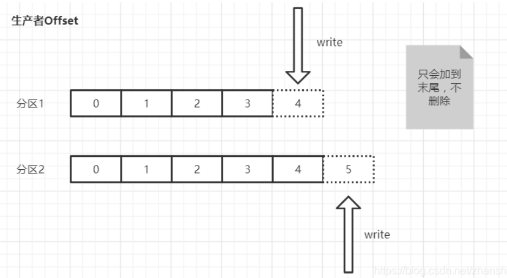

**消费者Offset**，消费者需要知道自己已经读取到了哪个位置。每个消费组（consumer group）中的消费者会独立地维护自己的
offset，当消费者从某个 partition 读取消息时，它会记录当前读取到的
offset。这样，及时消费者崩溃或者重启，还可以从上次读取到的位置继续消费，不会重复读取或者遗漏消息。（消费者offset需要消费消息并且提交后才会记录offset）

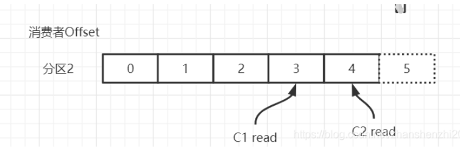

### 1.3.partition

Topic 是一个逻辑概念，Partition 是最小的存储单元，掌握着一个 Topic 的部分数据。

一个 topic 可以被分为若干个`分区`（partition），同一个主题中的不同分区可以不在一个机器上，也有可能会部署在同一个机器上。

在 producer 将 msg 发送给 broker 时，会根据分区规则，选择性的将消息存储到特定的分区中，只要分区规则设置的合理，那么所有的消息就会被均匀的分布到不同的分区中，这样就实现了
**负载均衡**、**水平扩展**和**并行消费**。

另外，多个consumer订阅一个分区中消息去消费，可以提高吞吐量 🤠。并且，msg 是追加的方式写入到分区中的，顺序写磁盘的总效率比随机写内存的效率还要高，这也是
Kafka 高吞吐量的重要保证之一。

### 1.4.broker

在 Kafka 中， **Broker** 是 Kafka 集群中的一个节点，负责处理客户端的请求（生产者、消费者）、存储数据（消息）、以及进行消息复制（副本同步）。每个
broker 都是 Kafka 集群中的独立服务器。

一个 Kafka 集群可以包含一个或多个 broker，它们共同分担 Kafka 的数据存储和处理负载。生产者将消息发送到 broker，消费者从
broker 拉取消息。

**Broker ID** 是 Kafka 集群中每个 broker 的唯一标识符（通常是一个整数）。它用来区分不同的 broker 节点。

- 在 Kafka 集群中，每个 broker 必须有一个唯一的 broker ID，集群内的其他 broker 和控制器通过这个 ID 来识别该 broker。
- 当 Kafka 启动时，broker ID 会被指定（通常是在 `server.properties` 配置文件中设置）。比如：
  ```properties
  broker.id=1
  ```
- Broker ID 也被用来管理 topic 的分区副本。例如，一个 topic 分区的副本可能会分布在不同的 broker 上，每个副本会记录在哪个
  broker（由 broker ID 表示）。

假设现在 kafka 的集群上有 3 个 broker，现在创建了一个 Topic A 有 3 个分区、Topic B 有 5 个分区：

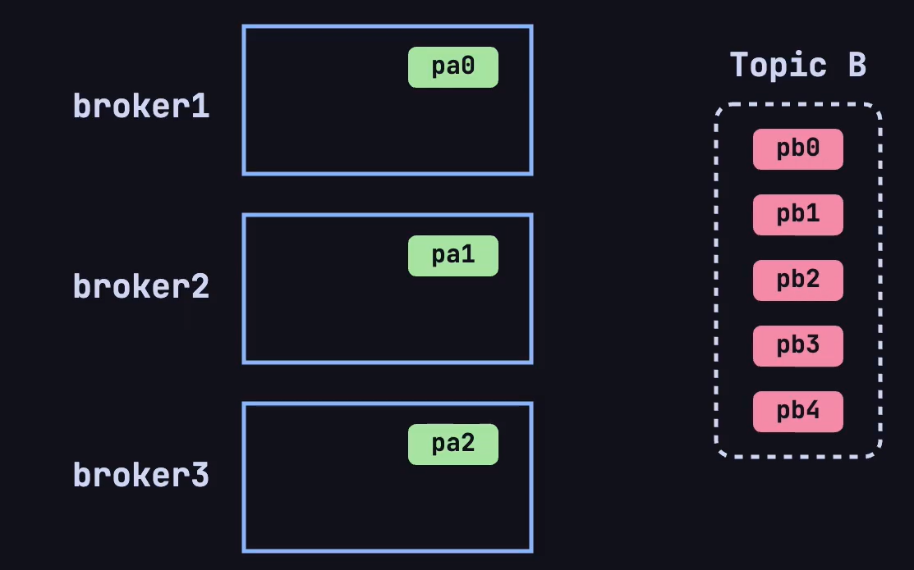

根据 Kafka 的默认分区规则，会按照下图方式将两个topic的不同分区这样放在broker上：


现在又有一个新的问题了，每个主题的分区会分布在不同的 broker 上，当客户端连接到任意一台服务器，怎么知道这个主题的分区具体在哪台
broker 上呢❓❓❓

这就又引出了一个新概念，在每个 broker 上都会存放**元数据**（metadata），用于了解集群中所有的 topic、分区、副本及其他 broker
的状态。这份元数据使得每个 broker 可以知道哪些 broker 存储了哪些分区的副本，哪些分区的 leader 在哪个 broker
上，以及它自己是否是某些分区的 leader。

produce/consumer 只要能连接上任意一台 broker ，就可以获取整个集群中的所有信息。

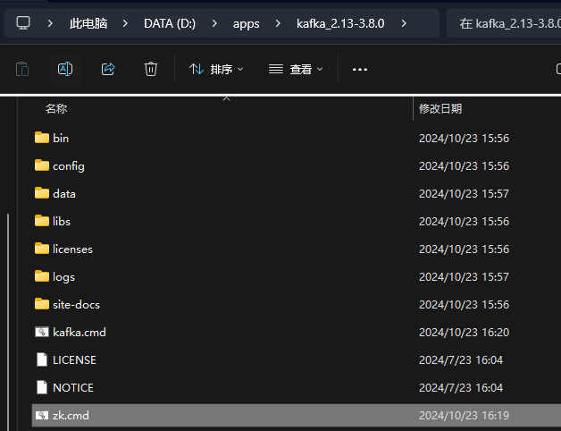

Kafka 的客户端（包括生产者和消费者）在连接集群时会与任意一个 broker 建立长连接，并通过这个连接获取元数据信息。具体流程如下：

- 当 Kafka 的生产者或消费者启动时，它们会连接到 Kafka 集群中的一个 broker，通常称为 `bootstrap broker`。
- 客户端连接上 broker 后，会向这个 broker 请求集群的**元数据**。这个 broker 会将最新的元数据返回给客户端，无论客户端最初连接的
  broker 是否是某个分区的 leader。元数据包含以下内容：
    - 所有 broker 的列表及其 ID 和地址。
    - 所有 topic 和分区的信息。
    - 每个分区的 leader 和副本所在的 broker。
- 客户端在收到元数据后，会将这份数据**缓存**下来，利用这份缓存的数据来决定与哪个 broker 通信，减少频繁的元数据请求开销。
    - **生产者** 在发送消息时可以直接将消息发送到某个分区的 leader broker。
    - **消费者** 可以根据元数据中的 leader 信息，直接从分区的 leader broker 拉取消息。

如果元数据失效or更新了，客户端怎么办❓❓❓

- Kafka 的客户端与 broker 通常是通过 **长连接**（持久 TCP 连接）进行通信的。客户端在启动后会保持与 broker
  的连接，并定期通过心跳机制来维持连接的状态，只需要重新发送请求就可以得知。

**简化的工作流程示意图**：

1. **客户端启动** -> 连接到 **任意 broker** -> 请求 **元数据**。
2. **客户端缓存元数据**。
3. **生产者** 根据元数据决定消息发送到哪个分区、哪个 broker。
4. **消费者** 根据元数据决定从哪个分区、哪个 broker 拉取消息。
5. **元数据失效**时，客户端会重新向 Kafka 集群请求最新的元数据。

### 1.5.replica

还有个新的问题是，如果集群中的某一台 broker 发生故障了，怎么办❓❓❓

这就是 `replica` 机制，在创建 topic 的时候，指定 `replica-factor` 副本因子，确定副本的数量：

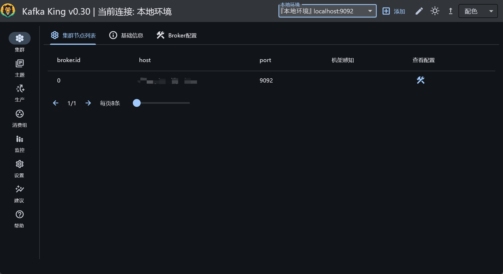

在 Kafka 中，每个分区（partition）都独立拥有一个 leader。如果一个 topic 有多个分区，那么每个分区都会有一个 leader
来处理该分区的数据读写操作，follower 用于同步 leader 的数据。

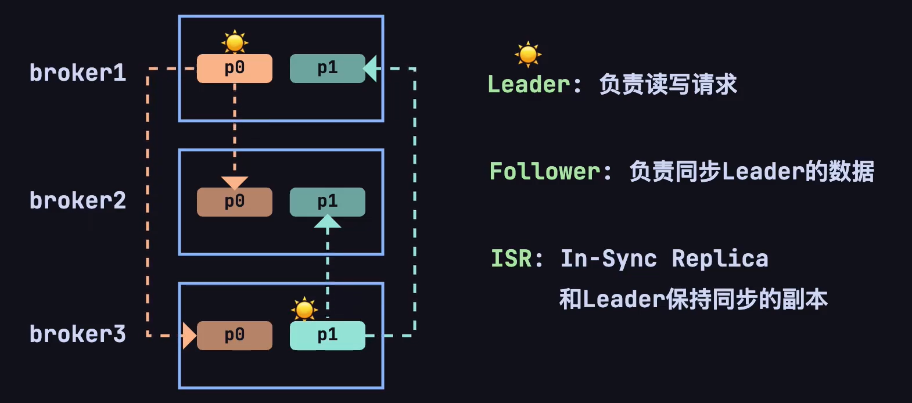

即使，其中一个 broker 宕机了，仍然可以通过副本供客户端访问。会重新选举出一个 leader，用于处理该分区的读写操作。

## 2.安装

为了便于学习，将在 windows 环境下安装 kafka，安装的版本为 [kafka_2.13-3.8.0.tgz](https://kafka.apache.org/downloads) ，含义是
scala 语言版本为 2.13，对应的 Kafka 版本是3.8.0。

### 2.1.下载解压

下载解压，由于是 tgz 文件，采用 powershell ，进入下载文件存放的目录，输入：

```shell
# 解压的目录，输入命令
tar -zxvf .\kafka_2.13-3.8.0.tgz
```

就可以解压文件：

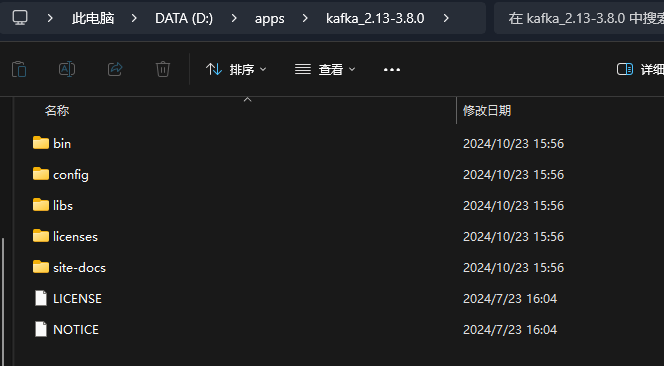

然后在你解压完文件的目录下，创建 `logs` 文件夹用于存放日志文件，创建 `data` 文件夹用于存放数据。

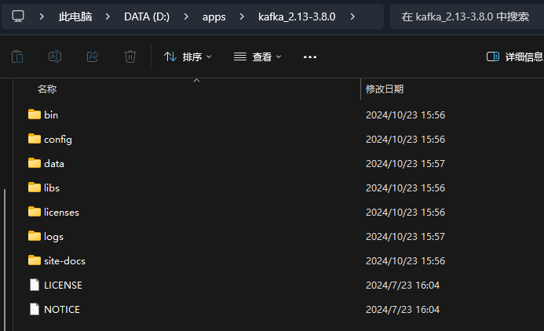

### 2.2.修改zk配置文件

进入 config 目录下，找到 `zookeeper.properties` 文件，配置存储路径：

```properties
dataDir=D:/apps/kafka_2.13-3.8.0/data
```

### 2.3.修改kafka配置文件

进入 config 目录下，找到 `server.properties` 文件，配置存储路径：

```properties
log.dirs=D:/apps/kafka_2.13-3.8.0/logs
```

### 2.4.创建zk启动脚本

在解压后的目录下，创建一个记事本，记事本中加入：

```text
call bin/windows/zookeeper-server-start.bat config/zookeeper.properties
```

重命名为 `zk.cmd`

### 2.5.创建kafka启动脚本

在解压后的目录下，创建一个记事本，记事本中加入：

```text
call bin/windows/kafka-server-start.bat config/server.properties
```

重命名为 `kafka.cmd`，至此，我们的解压后的目录多了两个文件夹和两个脚本文件：


### 2.6.启动

在启动的时候，必须先启动双击 `zk.cmd` 启动 zookeeper，再双击 `kafka.cmd` 启动 kafka；关闭的时候，需要先关闭 kafka，再关闭
zookeeper 。

### 2.7.kafka客户端

有一个 GUI 可以可视化看到 kafka
中的数据，比较方便学习，我所使用的是：[Kafka-King](https://github.com/Bronya0/Kafka-King?tab=readme-ov-file)，下载后配置使用即可。


## 3.常用命令

本地使用 Kafka King 真的挺不错的，各种功能都有😄。

如果是大型集群，建议使用：[Know Streaming](https://github.com/didi/KnowStreaming)，可以观察流量，Kafka中的数据积压。
在开发时候，需要关注的 `consumer group` 中的三个信息：

- current-offset：最后被消费的消息的偏移量
- log-end-offset：消息总量（最后一条消息的偏移量）
- lag：积压消息总量

其实在线上排查问题的时候，并没有很多工具可以使用，主要靠命令行：

**列出所有 Topic：**

````shell
./bin/kafka-topics.sh --list --bootstrap-server <ip:port>
````

**创建topic：**

````shell
# 创建名为 test 的topic，分区 1，副本 1
./bin/kafka-topics.sh --create --topic test --partitions 1 --replication-factor 1 --bootstrap-server <ip:port>
````

**查看 test 的 topic 下的消息量：**

````shell
./bin/kafka-run-class.sh kafka.tools.GetOffsetShell --broker-list <ip:port> --topic test
````

查看消费者的偏移量：

```shell
./bin/kafka-consumer-groups.sh --describe --group consumerName --bootstrap-server <ip:port>
```

**检查集群的状态,这个命令会显示 Kafka broker 支持的 API 版本以及其他集群信息**
````shell
./bin/kafka-broker-api-versions.sh --bootstrap-server <ip:port>
````

## 4.Java

终于进入正式篇了✌，从 Java 的角度来看 Kafka 有两个维度：

- producer：编写Java代码，朝 topic 中发送消息
- consumer：消费 topic 中的消息

### 4.1.环境搭建

现代开发，都是基于 SpringBoot 作为框架去迅速开发，首先进行环境搭建，引入 kafka 的依赖：

```xml
<!--kafka-->
<dependency>
    <groupId>org.springframework.kafka</groupId>
    <artifactId>spring-kafka</artifactId>
</dependency>
```

编写配置文件 `application.yml` :

```yml
server:
  port: 3489

spring:
  kafka:
    bootstrap-servers: localhost:9092
    producer:
      key-serializer: org.apache.kafka.common.serialization.StringSerializer
      value-serializer: org.apache.kafka.common.serialization.StringSerializer
    consumer:
      key-deserializer: org.apache.kafka.common.serialization.StringDeserializer
      value-deserializer: org.apache.kafka.common.serialization.StringDeserializer
```

### 4.2.producer

#### 4.2.1.入门

基于 SpringBoot ，编写代码，朝刚刚创建的名为 test 的topic发送消息。在日常的开发中，其实很简单:

```java:line-numbers
@SpringBootTest
@Slf4j
class KafkaDemoApplicationTests {

    // 引入spring-kafka后，SpringBoot会自动装配
    @Resource
    private KafkaTemplate<String, String> kafkaTemplate;

    @Test
    void test01() {
        kafkaTemplate.send("test", "msg");
    }
}
```

这样就可以直接发送成功了，这就是最简单的发送消息咯。需要注意的是，之前在引入 KafkaTemplate ：

```java
KafkaTemplate<K, V>

Type parameters:
<K> – the key type. <V> – the value type.
```

显示的制定了泛型 K 和 V，使用String类型.

#### 4.2.2.send()

KafkaTemplate 提供了好几种发送消息的方式：

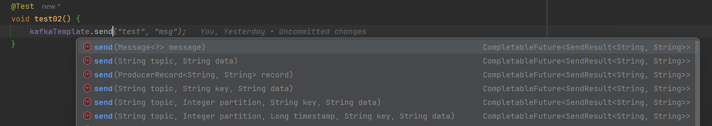

分别的含义是：

- 发送消息类，message中已提前封装好信息
- 指定topic、data
- 发送producerRecord对象，已提前封装好各种信息
- 指定topic、key、data
- 指定topic、partition、key、data
- 指定topic、partition、时间戳、key、data

日常就是根据你想要的方式，去选择性的使用方法即可。

`Message<?> message` 的使用：

```java
    /**
     * KafkaHeaders：中可以设置很多参数
     * payload：消息体内容
     */
    @Test
    void test02() {
        Message<String> msg = MessageBuilder.withPayload("send Message<?> message")
                .setHeader(KafkaHeaders.TOPIC, "test")
                .build();
        kafkaTemplate.send(msg);
    }
```

`ProducerRecord<K, V> record` 的使用：

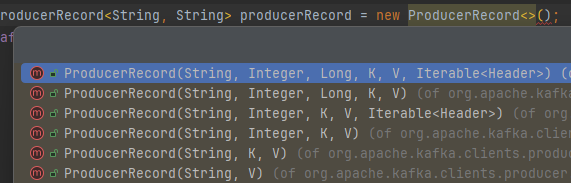

```java
    /**
     * ProducerRecord的使用
     */
    @Test
    void test03() {
        ProducerRecord<String, String> producerRecord = new ProducerRecord<>("test", "ProducerRecord<K, V> record");
        kafkaTemplate.send(producerRecord);
    }
```

#### 4.2.3.sendDefault()

KafkaTemplate 还有一个名为 `sendDefault()` 的方法，如下：

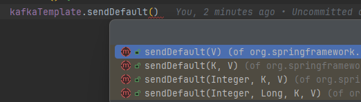

可以观察到，在这些方法中没有 topic ，是因为如果需要使用前，需要在配置文件中写明默认发送的主题：

```yml
spring:
  kafka:
    bootstrap-servers: localhost:9092
    producer:
      key-serializer: org.apache.kafka.common.serialization.StringSerializer
      value-serializer: org.apache.kafka.common.serialization.StringSerializer
    consumer:
      key-deserializer: org.apache.kafka.common.serialization.StringDeserializer
      value-deserializer: org.apache.kafka.common.serialization.StringDeserializer
      group-id: test-consumer
      auto-offset-reset: earliest
    template:
      default-topic: test # 配置默认发送的主题
```

采用这个方法发送消息，会自动发送到配置文件中写明的主题中:

```java
    /**
     * sendDefault的使用
     */
    @Test
    void test04() {
        kafkaTemplate.sendDefault("sendDefault");
    }
```

#### 4.2.4.发送结果

发送消息的方法都学完了，如何获取消息发送完的结果呢？是否发送成功❓❓❓

无论是 `send()` 方法还是 `sendDefault` 方法，都会返回一个 `CompletableFuture<SendResult<K, V>>`
对象，是一个异步计算回调后的结果，去调用相关的函数就可执行后续操作。

CompletableFuture 的使用见：还没写。

#### 4.2.5.发送流程

Kafka 生产者的发送消息的流程为：

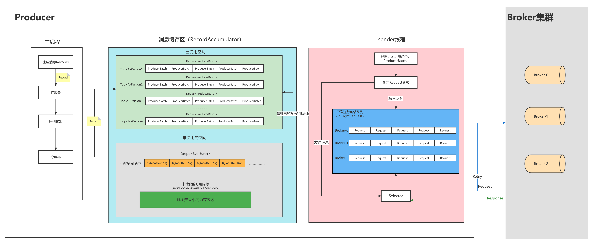

拦截器--------》序列化器--------》分区器

#### 4.2.6.分区器

如果一个 topic 存在多个分区，producer 向 topic 中发送消息时，采用什么何种策略将消息发送到哪个区域呢❓❓❓

阅读源码发现：

```java
    /**
     * computes partition for given record.
     * if the record has partition returns the value otherwise
     * if custom partitioner is specified, call it to compute partition
     * otherwise try to calculate partition based on key.
     * If there is no key or key should be ignored return
     * RecordMetadata.UNKNOWN_PARTITION to indicate any partition
     * can be used (the partition is then calculated by built-in
     * partitioning logic).
     */
    private int partition(ProducerRecord<K, V> record, byte[] serializedKey, byte[] serializedValue, Cluster cluster) {
        if (record.partition() != null)
            return record.partition();

        if (partitioner != null) {
            int customPartition = partitioner.partition(
                record.topic(), record.key(), serializedKey, record.value(), serializedValue, cluster);
            if (customPartition < 0) {
                throw new IllegalArgumentException(String.format(
                    "The partitioner generated an invalid partition number: %d. Partition number should always be non-negative.", customPartition));
            }
            return customPartition;
        }

        if (serializedKey != null && !partitionerIgnoreKeys) {
            // hash the keyBytes to choose a partition
            return BuiltInPartitioner.partitionForKey(serializedKey, cluster.partitionsForTopic(record.topic()).size());
        } else {
            return RecordMetadata.UNKNOWN_PARTITION;
        }
    }
```

生产者向多分区的 topic 发送消息时，分区选择策略可以根据消息是否包含 **Key** 或 **自定义分区器** 来决定，逻辑如下：

- **如果指定了分区号**：消息直接发送到指定的分区
- **如果没有指定分区，但指定了 Key**：
    - Kafka 使用 Key 的哈希值来计算目标分区。具体算法就是使用 `Utils.murmur2` 方法将 Key 哈希为一个整数，然后再取正数，以保证哈希值非负：
      ```java
      Utils.toPositive(Utils.murmur2(serializedKey)) % numPartitions;
      ```
    - 这样可以确保相同 Key 的消息发送到相同的分区，方便消费端实现 Key 的数据顺序性。
- **如果既没有指定分区也没有指定 Key**：
    - 采用的是一种伪轮询策略 `StickyPartitioner` 实现的动态选择分区的逻辑
    - 主要依据当前集群的负载状态以及可用分区情况来做决定。代码逻辑可分为两种情况：
        - **没有分区负载信息**：则从可用分区中随机选择一个分区；若无可用分区，则在全部分区中随机选择。
        - **有分区负载信息**：则基于分区的负载权重进行选择。代码生成一个随机数，根据分区负载的累积频率表，使用二分查找找到对应的分区，保证将更多消息发送到负载较低的分区。

自己可以配置其它提供的分区策略，或自己定义一个分区策略，实现逻辑如下：

```java
@Configuration
public class KafkaConfig {
    /**
     * 生产者创建工厂
     */
    public ProducerFactory<String, String> producerFactory() {
        return new DefaultKafkaProducerFactory<>(producerConfigs());
    }

    /**
     * 生产者相关配置，都在ProducerConfig类中
     */
    public Map<String, Object> producerConfigs() {
        Map<String, Object> config = new HashMap<>();
        config.put(ProducerConfig.BOOTSTRAP_SERVERS_CONFIG, "localhost:9092");
        config.put(ProducerConfig.KEY_SERIALIZER_CLASS_CONFIG, StringSerializer.class);
        config.put(ProducerConfig.VALUE_SERIALIZER_CLASS_CONFIG, StringSerializer.class);
        //指定RoundRobin分区策略
        config.put(ProducerConfig.PARTITIONER_CLASS_CONFIG, RoundRobinPartitioner.class);
        return config;
    }

    /**
     * 覆盖默认配置类中的KafkaTemplate
     */
    @Bean
    public KafkaTemplate<String, String> kafkaTemplate() {
        return new KafkaTemplate<>(producerFactory());
    }
}
```

如果想要实现自定义的分区策略呢？其实道理都是一样的，只需要再多谢一个类，实现 `` 接口：

```java
public class CustomPartitioner implements Partitioner {

    /**
     * 计算分区逻辑部分代码
     */
    @Override
    public int partition(String topic, Object key, byte[] keyBytes, Object value, byte[] valueBytes, Cluster cluster) {
        return 0;
    }

    @Override
    public void close() {
        // 可不写
    }

    @Override
    public void configure(Map<String, ?> configs) {
        // 可不写
    }
}
```

然后，在生产者的配置类中配置即可：

```java
@Configuration
public class KafkaConfig {
    ...

    /**
     * 生产者相关配置，都在ProducerConfig类中
     */
    public Map<String, Object> producerConfigs() {
        Map<String, Object> config = new HashMap<>();
        config.put(ProducerConfig.BOOTSTRAP_SERVERS_CONFIG, "localhost:9092");
        config.put(ProducerConfig.KEY_SERIALIZER_CLASS_CONFIG, StringSerializer.class);
        config.put(ProducerConfig.VALUE_SERIALIZER_CLASS_CONFIG, StringSerializer.class);
        //指定自定义的发送消息分区策略
        config.put(ProducerConfig.PARTITIONER_CLASS_CONFIG, CustomPartitioner.class);
        return config;
    }

    ...
}
```

#### 4.2.7.拦截器

如果想要实现自定义的拦截器，需要实现 `ProducerInterceptor` 接口：

```java
public class CustomInterceptor implements ProducerInterceptor<String, String> {

    /**
     * 发送消息前，会先调用这个方法
     */
    @Override
    public ProducerRecord<String, String> onSend(ProducerRecord<String, String> record) {
        log.info("自定义消息拦截器 success ........");
        return record;// 需要将消息发送出去
    }

    /**
     * 服务器收到消息后的确认
     */
    @Override
    public void onAcknowledgement(RecordMetadata metadata, Exception exception) {

    }

    @Override
    public void close() {
        //可不写
    }

    @Override
    public void configure(Map<String, ?> configs) {
        //可不写
    }
}
```

在之前编写的 kafka 配置类中添加即可：

```java
    /**
     * 生产者相关配置，都在ProducerConfig类中
     */
    public Map<String, Object> producerConfigs() {
        Map<String, Object> config = new HashMap<>();
        config.put(ProducerConfig.BOOTSTRAP_SERVERS_CONFIG, "localhost:9092");
        config.put(ProducerConfig.KEY_SERIALIZER_CLASS_CONFIG, StringSerializer.class);
        config.put(ProducerConfig.VALUE_SERIALIZER_CLASS_CONFIG, StringSerializer.class);
        //指定自定义的发送消息分区策略
        config.put(ProducerConfig.PARTITIONER_CLASS_CONFIG, CustomPartitioner.class);
        //指定自定义的发送消息拦截器
        config.put(ProducerConfig.INTERCEPTOR_CLASSES_CONFIG,CustomInterceptor.class.getName());
        return config;
    }
```

### 4.3.consumer

#### 4.3.1.监听机制

如何使用Java代码来监听topic，消费消息呢？是通过监听机制来实现的：

```java:line-numbers
@Service
@Slf4j
public class EventConsumer {

    @KafkaListener
    public void consume(ConsumerRecord<String, String> record) {
        log.warn("监听到 topic：{}， 的消息内容为：{}", record.topic(), record.value());
    }
}
```

通过 `@KafkaListener` 注解，实现在启动项目的时候，监听 Kafka 中 topic 内的内容变化，但是直接启动会报错：

:::details 报错信息
Error starting ApplicationContext. To display the condition evaluation report re-run your application with 'debug'
enabled.
22:32:19.643 [main] ERROR o.s.boot.SpringApplication - Application run failed
java.lang.IllegalStateException: topics, topicPattern, or topicPartitions must be provided
:::

在使用这个注解的时候，需要指定一些信息：

```java
@KafkaListener(topics = {"test"})
public void consume(ConsumerRecord<String, String> record) {
    log.warn("监听到 topic：{}， 的消息内容为：{}", record.topic(), record.value());
}
```

但仍然报错：

:::details 报错信息
Caused by: java.lang.IllegalStateException: No group.id found in consumer config, container properties, or
@KafkaListener annotation; a group.id is required when group management is used.
:::

可以通过配置文件 or 在注解中指定 `consumer group` ，大部分项目中都是使用一个消费组，一般都在配置文件中指定：

```yml:line-numbers
spring:
  kafka:
    bootstrap-servers: localhost:9092
    producer:
      key-serializer: org.apache.kafka.common.serialization.StringSerializer
      value-serializer: org.apache.kafka.common.serialization.StringSerializer
    consumer:
      key-deserializer: org.apache.kafka.common.serialization.StringDeserializer
      value-deserializer: org.apache.kafka.common.serialization.StringDeserializer
      group-id: test-consumer
```

成功启动项目，但是发现，控制台并没有输出相关日志，尝试再次发送消息到 kafka 中，发现日志正常打印。这是因为 consumer
的默认配置就是，从消费者开始工作后的新消息才会被处理。

#### 4.3.2.消费偏移量策略

这就引入了一项配置，Kafka 消费者的 `auto-offset-reset`
配置用于指定当消费者组的偏移量（offset）不存在或不可用时（例如，第一次消费或偏移量已过期被删除）应该从哪里开始消费消息。常用的选项为
`latest`（SpringBoot 默认项）、`earliest`，但是总共有四种：

- **`latest`**
    - 含义：当没有有效偏移量时，从 **最新的消息** 开始消费。
    - 用法：消费者会忽略历史消息，只消费新产生的消息。
    - 适合场景：适用于只关心新数据、不需要处理历史消息的情况。
    - 举例：如果当前 topic 中已经有 100 条消息，而消费者第一次连接时使用 `latest`，则它会从第 101 条消息开始消费。
- **`earliest`**
    - 含义：当没有有效偏移量时，从 **最早的消息** 开始消费。
    - 用法：消费者会从分区的起始位置（即偏移量 0）开始读取数据。
    - 适合场景：适用于需要处理所有历史消息的情况，或者系统第一次启动时。
    - 举例：如果 `earliest` 被设置，消费者会从最早的消息开始处理，无论消息已经存在了多久。
- **`none`**
    - 含义：当没有偏移量可供恢复时，抛出错误，表示没有合适的偏移量。
    - 用法：只有在消费者组有已存储的偏移量时才会启动，否则会报错并停止。
    - 适合场景：适用于不允许任何数据丢失或跳过的应用中，确保消费者组的偏移量总是存在。
    - 举例：如果该消费者组从未消费过该 topic，或者偏移量被清除，客户端会直接报错，避免消息丢失。
- **`exception`**
    - 含义：该选项并不是 Kafka 的官方设置；通常通过 `none` 和自定义错误处理来实现类似的效果。
    - 处理方式：遇到无法获取偏移量的情况时抛出异常，以便应用程序进行自定义处理。

❗❗❗如果之前已经使用过相同的 `consumer-group-id` 消费过，Kafka 会保存该消费组的偏移量。即使重新设置了消费者的
`auto-offset-reset=earliest` ，该配置也不会生效。此时，要么使用新的消费组or重置该消费组的的偏移量。

Kafka 中提供了脚本工具，用于手动重置消费组的偏移量：

```shell
# 进入 Kafka 安装目录的 bin 目录，使用 kafka-consumer-groups.sh 工具
./kafka-consumer-groups.sh --bootstrap-server <broker地址> \
                           --group <消费组ID> \
                           --topic <topic名称> \
                           --reset-offsets \
                           --to-earliest \
                           --execute
```

```cmd
kafka-consumer-groups.bat --bootstrap-server localhost:9092 ^
                          --group test-consumer ^
                          --topic test ^
                          --reset-offsets ^
                          --to-earliest ^
                          --execute
```

❗❗❗记住，消费组的状态需要为 `inactive` 否则会重置消费组偏移量失败：

:::details 重置结果细节
Error: Assignments can only be reset if the group 'test-consumer' is inactive, but the current state is Stable.
:::

重置成功后就可以监听到 test 主题下的所有消息咯~

