# Vitepress搭建博客

无意中接触到了 `Vitepress` ，这不就是我想要的博客的搭建方式嘛？

- 通过写好 md 文档，将其加入项目中
- 部署项目，就可以通过静态文件加载的方式去呈现个人博客
- 使用简单，模板好看

于是，就这样子，开干。参考的文档和教程如下：

- [AlbertZhang的文档网站](https://docs.bugdesigner.cn/)
- [手把手教你使用vitepress搭建并部署一个自己的知识库（无需服务器](https://www.bilibili.com/video/BV1XW4y1w7bc)
- [快速开始 | VitePress](https://vitepress.dev/zh/guide/getting-started)

但是我还是进行了一些个人的 DIY，现在将所有的步骤汇总成文档，记录自己采用 `Vitepress` 搭建个人博客项目的过程吧~


## 1.前置条件

我是使用 `windows` 在个人电脑上开发，在想要使用 `Vitepress` 搭建个人博客前，需要你具备以下的条件：

- node 环境
- npm 管理环境（pnpm也可以，但是以下教程都是基于 npm 实现的，如果是 pnpm 管理的同学，参考： [AlbertZhang的文档网站](https://docs.bugdesigner.cn/)）

```cmd
# 打开控制台窗口查看 node 和 npm 的版本：node-v20.17.0，npm-10.8.2
node -v
npm -v
```

如果没有安装相关环境，请自行去安装，安装成功后，下载一个前端开发工具，推荐 `VSCode` or `WebStorm` ，我使用的是 `WebStorm`  。


## 2.项目结构

和默认的项目组成结构有点区别，我改成了自己喜欢的方式：

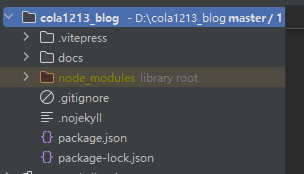

| 目录名称   | 作用                 |
| ---------- | -------------------- |
| .vitepress | 存储js，控制相关跳转 |
| docs       | 全部都是md文档       |


## 3.开始搭建

### 3.1.初始化

前面介绍了很多了，现在就正式开始我的搭建流程了。

首先，创建一个文件夹目录，比如 `blog` ，这个文件夹放哪儿都无所谓，然后进入文件夹目录下，打开 `cmd` 命令行窗口：

```cmd
npm add -D vitepress
```

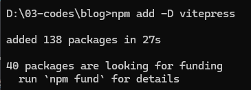

初始化 `Vitepress`：

```cmd
npx vitepress init
```

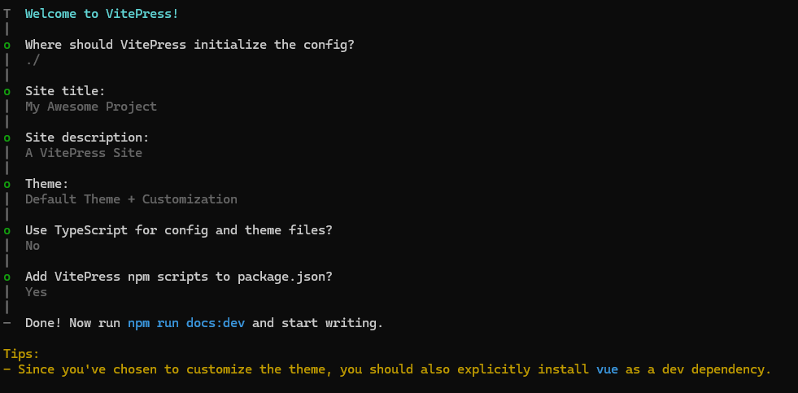


### 3.2.运行

到这里了，已经初始化好项目了，可以使用前端开发工具打开项目：

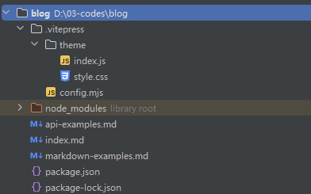

介绍一下我们要用到的文件：

| 文件名     | 含义                                                       |
| ---------- | ---------------------------------------------------------- |
| config.mjs | 最核心的文件，各种配置导航栏、侧边栏、标题什么的都是在这里 |
| index.md   | 主页相关                                                   |

按照之前介绍的设定的目录结构，现在来改造一下项目，挪动项目的目录层级：

- 将自带的三个 md 文档挪动到新建的 docs 目录下
- 在 `config.mjs` 文件下，新增一行代码，修改路径

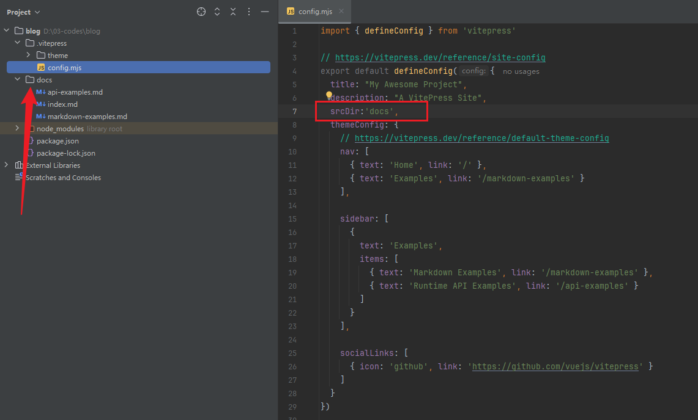

至此，运行 `package.json` 中的：

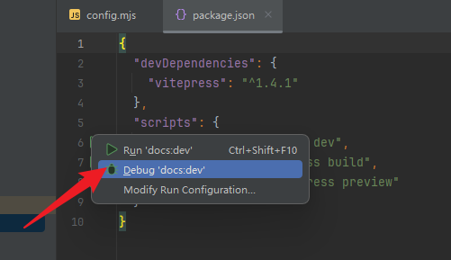

打开控制台中的地址链接  http://localhost:5173/ ，成功跳转，显示页面：

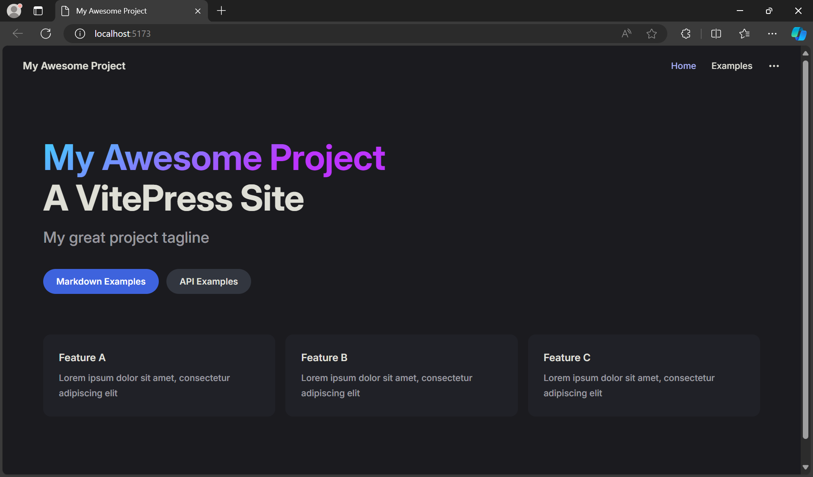


### 3.3.改造导航栏

改造部分，我的思路是，新建一个菜单 `menu.js` 专门负责顶部导航栏和侧边导航栏的跳转和映射，于是：

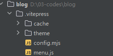

- `menu.js`

```js:line-numbers
/**
 * 左侧菜单栏
 * -------------------------------------------------------------------------- */
export function sidebar() {
    return {
        // 顶部导航栏一
        "/nav1/": [
            {
                text: "aaaa",
                base: "/nav1/aaaa/",
                items: [
                    {text: "test01", link: "test01.md"},
                    {text: "test02", link: "test02.md"},
                ],
                collapsed: false,
            },
            {
                text: "bbbb",
                base: "/nav1/bbbb/",
                items: [
                    {text: "test03", link: "test03.md"}
                ],
                collapsed: false,
            },
        ],
        // 顶部导航栏二
        "/nav2/": [
            {text: "test04", link: "/nav2/test04.md"},
            {text: "test05", link: "/nav2/test05.md"}
        ]
    };
}

/**
 * 顶部导航栏
 * -------------------------------------------------------------------------- */
export function nav() {
    return [
        {text: "首页", link: "/"},
        {
            text: "顶部导航栏一",
            link: "/nav1/aaaa/test01.md",
            activeMatch: "/nav1/"
        },
        {
            text: "顶部导航栏二",
            link: "/nav2/test04.md",
            activeMatch: "/nav2/",
        }
    ];
}
```

文档的目录层级为：

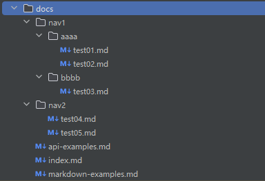

需要修改 `config.js` ：

```js:line-numbers
import { defineConfig } from 'vitepress'
import {nav,sidebar} from "./menu.js";

// https://vitepress.dev/reference/site-config
export default defineConfig({
  title: "My Awesome Project",
  description: "A VitePress Site",
  srcDir:'docs',
  themeConfig: {
    // https://vitepress.dev/reference/default-theme-config
    // 顶部导航栏和侧边导航栏，写一个函数返回对象
    nav: nav(),
    sidebar:sidebar(),
    // 右侧导航栏
    outlineTitle: "文档目录",
    outline: {
      level: [2, 6], // 标题级别2-6级
    },
    // 设置搜索框的样式
    search: {
      provider: "local",
      options: {
        translations: {
          button: {
            buttonText: "搜索文档",
            buttonAriaLabel: "搜索文档",
          },
          modal: {
            noResultsText: "无法找到相关结果",
            resetButtonTitle: "清除查询条件",
            footer: {
              selectText: "选择",
              navigateText: "切换",
            },
          },
        },
      },
    },
    socialLinks: [
      {icon: 'github', link: 'https://github.com'}
    ],
    docFooter: {
      //文档页脚
      prev: '上一篇',
      next: '下一篇'
    },
    lastUpdated: {
      text: "最后更新于", // 你必须使用git commit提交 markdown 文件才能看到最后更新时间。
      formatOptions: {
        dateStyle: "short", // full
        timeStyle: "short", // medium
      },
    },
    // 主页的底部配置，定义一个 footer
    footer: {
      copyright: "Copyright@ test test"
    },
    markdown: {
      lineNumbers: true
    },
  }
})
```

最终的效果为：

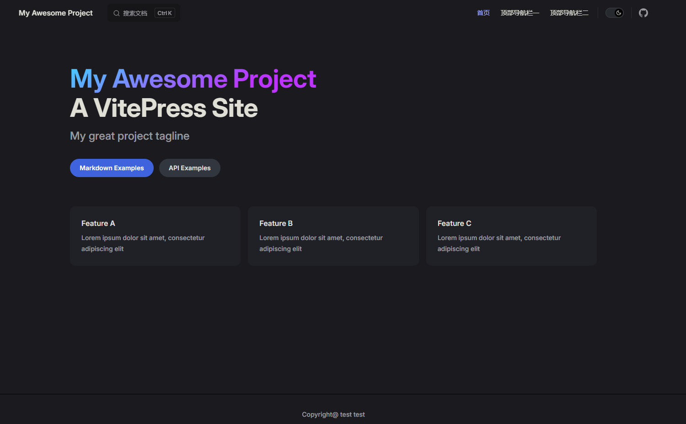

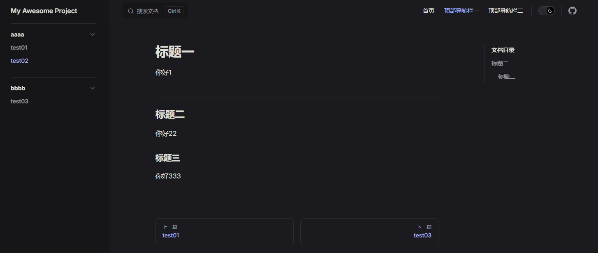


### 3.4.改造主页面

主页面在 `index.md` 文档中，随意改造，[vitepress搭建并部署网站 | AlbertZhang的文档网站](https://docs.bugdesigner.cn/docs/Tutorial/vitepress.html) 写的很清楚，按步骤来就行。

- [iconfont-阿里巴巴矢量图标库](https://www.iconfont.cn/)
- [VitePress 快速入门 | 李钟意讲前端](https://docs.ffffee.com/vitepress/vitepress-quick-start.html)


## 4.结束语

至此，基于 `Vitepress` 脚手架，快速搭建一个博客项目已经结束。可以成功在本地运行，后面会讲述如何将博客托管到 github 中。