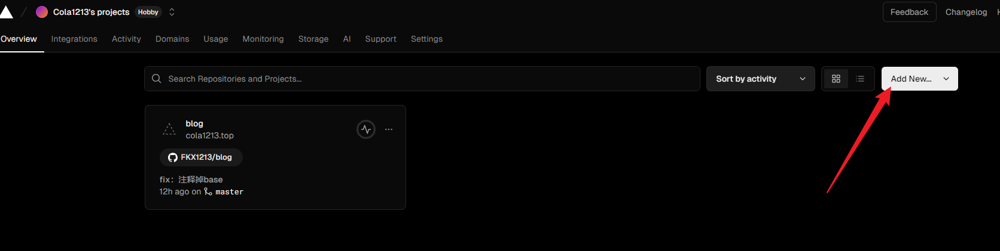
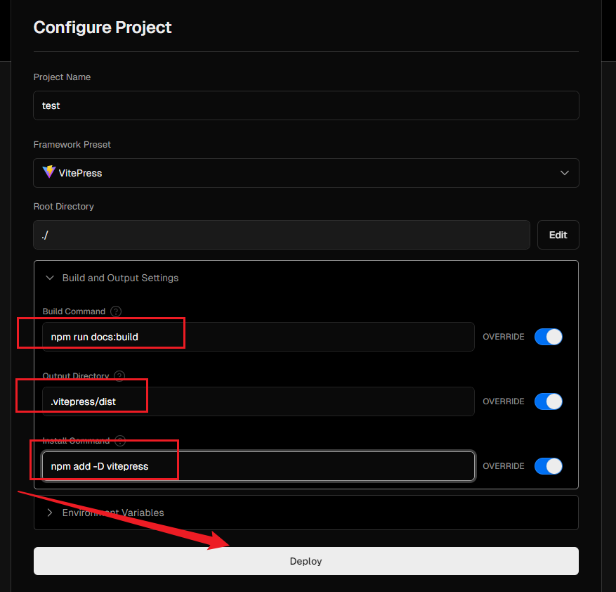
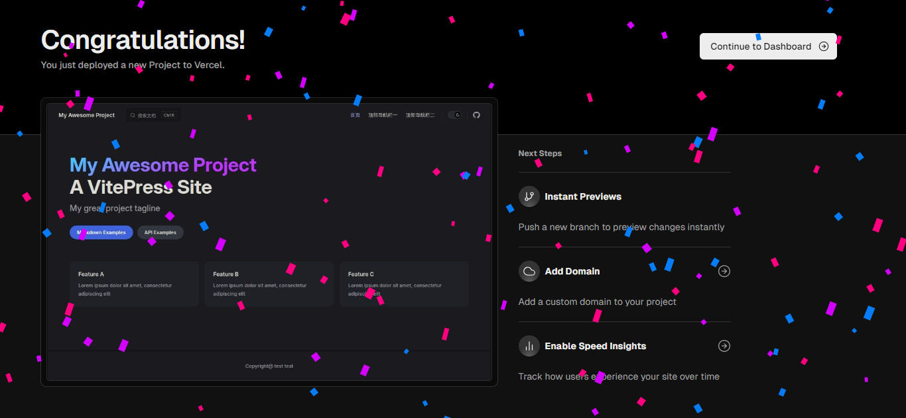
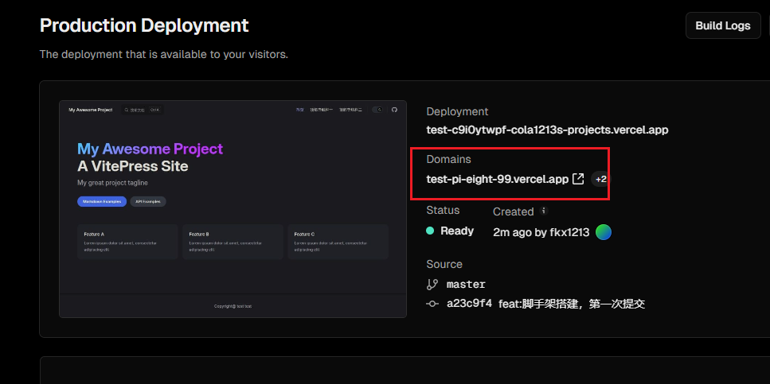

# Vercel部署博客

:heavy_exclamation_mark: :heavy_exclamation_mark::heavy_exclamation_mark: 科学上网

## 1.注册和登录

参见教程：

[两分钟使用 Vercel 免费部署你的静态网站_哔哩哔哩_bilibili](https://www.bilibili.com/video/BV1kX4y1v75w)

## 2.部署项目

这一步骤的前提是，假设你已经成功注册和登录了，并且关联了 github 账号。

首先，add a new project：

关联之前的博客项目：

配置好这些参数，开始 deploy：

good good，成功部署咯：

## 3.访问

点击 `continue to dashboard` ，通过 `domains` 可以访问，但还得是科学上网：

