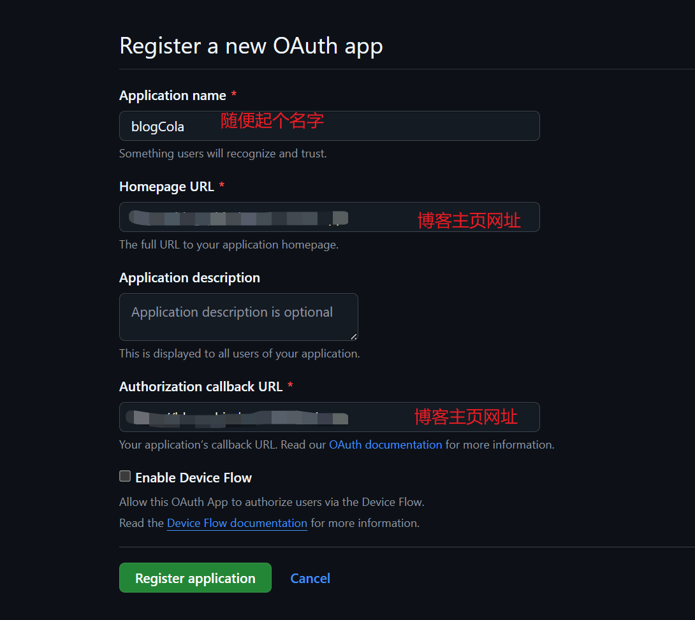
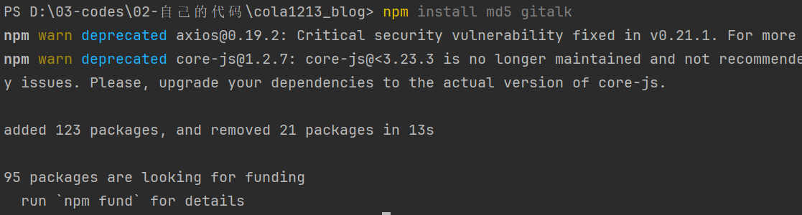
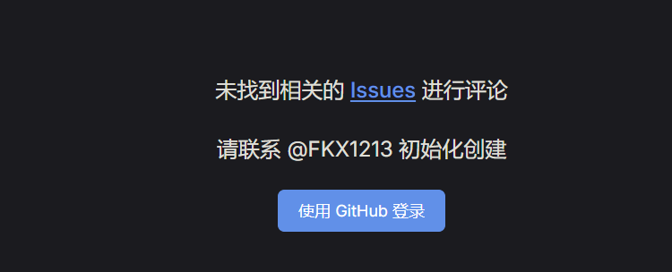
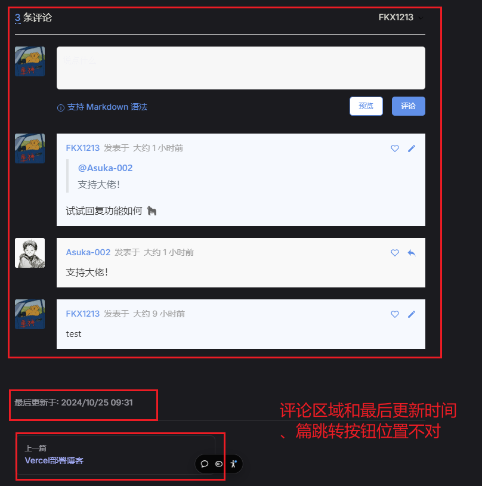

# 引入gittalk功能

应一位朋友的邀请，引入gittalk功能，可以进行互动。撸起袖子加油干，不会就学。

::: details 参考资料
- [VitePress 使用 Gitalk 添加评论功能](https://libraheresy.github.io/site/blog/VitePress/VitePress_%E4%BD%BF%E7%94%A8_Gitalk_%E6%B7%BB%E5%8A%A0%E8%AF%84%E8%AE%BA%E5%8A%9F%E8%83%BD)
:::

## 1.注册应用

进入Github，进入个人设置Settings，最下方Developer settings，点击：OAuth Apps，点击：New OAuth App



创建一个，此刻获取到clientID和clientSecret

## 2.安装依赖

在博客的终端控制台，输入命令：
```shell
npm install md5 gitalk
```


## 3.新增配置

新增 `.vitepress/components/gitalk.vue` ，默认gitalk存在黑色模式下字体白色，背景色也是白色，导致看不见字体，所以样式里设置一下：

```vue:line-numbers
<template>
  <div class="gitalk-container">
    <div id="gitalk-container"></div>
  </div>
</template>
<script>
import md5 from "md5"
import Gitalk from "gitalk"
import "gitalk/dist/gitalk.css"

export default {
  name: "gitalk",
  data() {
    return {}
  },
  mounted() {
    const commentConfig = {
      clientID: "你的clientID",
      clientSecret: "你的clientSecret",
      repo: "github仓库名", // 用于存放评论，可以新建一个
      owner: "名称",
      admin: ["名称"],
      id: md5(location.pathname),
      distractionFreeMode: false,
    }
    const gitalk = new Gitalk(commentConfig)
    gitalk.render("gitalk-container")
  },
}
</script>
<style>
.gt-container .gt-header-textarea {
  color: #000;
}
</style>
```

编辑 `.vitepress/theme/index.ts`

```ts
import DefaultTheme from 'vitepress/theme';
import './custom.css';
// @ts-ignore
import comment from "../components/gitalk.vue";// 引入这一段

export default {
  ...DefaultTheme,
  enhanceApp(ctx) {
    DefaultTheme.enhanceApp(ctx)
    ctx.app.component("gitalk", comment)// 引入这一段
  },
};
```

## 4.使用

在需要的Markdown里使用 `<git-talk />` 开启评论

## 5.评论仓库的问题

由于我只是在 github 上创建了一个仓库，并没有初始化，也没有开启 issue ，导致出现：



需要去对应的 issue 存放仓库，进行如下操作：
- 进入仓库
- settings
- 滑到 features
- 确定自己打开了 issues 选项

如果还是出现这种问题，大概率是自己在本地 debug 启动，由于在 OAuth App 设置的两个 url 是项目部署的路径，和本地不一样。可以先push代码，从项目部署路径查阅。

实在不行，打开页面的管理工具，看是否自动触发请求到 github 的 gittalk 中，自行 debug。有问题的可以在这个页面下留言，讨论~~~~😁😁😁😁😁

## 6.小问题修复

在使用的时候，发现问题：



打算尝试新的方法去解决，在 `.vitepress` 目录中的 `theme` 创建一个 `layout` 目录，内创建 `GitalkLayout.vue` 文件，文件内容：

```vue:line-numbers
<template>
  <Layout>
    <template #doc-after>
      <div v-if="initGitalkStep" id="gitalk-container"></div>
    </template>
  </Layout>
</template>

<script lang="ts" setup>
import md5 from "md5"
import { useRoute } from 'vitepress'
import Theme from 'vitepress/theme'
import { ref, watch, onMounted, nextTick } from 'vue'
import Gitalk from 'gitalk'
import "gitalk/dist/gitalk.css"

const { Layout } = Theme
const route = useRoute()
// 当前加载状态
// 0 DOM 中无元素，此时调用应将元素插入到 DOM 中，等下个 step 再加载
// 1 DOM 中有元素，此时调用应用已有 DOM 元素初始化评论插件，加载后步骤完成，不需要再做什么了
// 2 插件已经加载，此时调用应是切换页面了，应删除页面中的 DOM 元素，等下个 step 再插入
const initGitalkStep = ref(0)

const initGitalk = () => {
  // 切换页面时，刷新评论组件
  switch (initGitalkStep.value) {
    case 0: // DOM 中无元素，此时调用应将元素插入到 DOM 中，等下个 step 再加载
      initGitalkStep.value = 1
      nextTick(initGitalk)
      return
    case 1: // DOM 中有元素，此时调用应用已有 DOM 元素初始化评论插件，加载后步骤完成，不需要再做什么了
      initGitalkStep.value = 2
      break
    case 2: // 插件已经加载，此时调用应是切换页面了，应删除页面中的 DOM 元素，等下个 step 再插入
      initGitalkStep.value = 0
      nextTick(initGitalk)
      return
  }

  // 创建评论组件
  const gitTalk = new Gitalk({
    // GitHub 账号 <==== 按你的实际情况修改 ====>
    owner: 'FKX1213',
    // 仓库名 <==== 按你的实际情况修改 ====>
    repo: 'blogComments',
    // 客户端 ID <==== 按你的实际情况修改 ====>
    clientID: 'Ov23likVb5bs19Ssmf2k',
    // 客户端密钥 <==== 按你的实际情况修改 ====>
    clientSecret: '7c408950cfa3ba7e83947a4e902226227b8a811e',
    // Github 账号 <==== 按你的实际情况修改 ====>
    admin: [ 'FKX1213' ],
    // 创建 Issue 时，为 Issue 增加的标签
    // labels: [ 'GitTalk' ],
    // 如果 Issue 不存在，且登陆的是管理员账号，是否显示创建 Issue 按钮
    createIssueManually: true,
    // 创建 Issue 时，用于唯一标识这篇文章的标记
    id: md5(location.pathname),
    // 撰写评论时，给一个全屏遮罩，聚焦到评论框
    distractionFreeMode: true,
  })
  // 渲染到 DOM 元素中
  gitTalk.render('gitalk-container')
}

// 初始化和页面切换时加载评论插件
onMounted(initGitalk)
watch(
    () => route.path,
    initGitalk,
)
</script>
```

在 `.vitepress` 目录中的 `theme` 中的 `index.js` ，使用刚刚创建的 Layout 替换默认的 Layout：

```js
import GitalkLayout from './layout/GitalkLayout.vue'

export default {
  // 使用自定义布局替换默认布局
  Layout: GitalkLayout,
}
```

至此，解决好了 ✌✌✌✌✌✌

以后，再也不用在 md 文档的底部，输入 `<git-talk />`  标签啦！！！！！