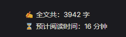

# ReadingStats

阅读很多博客文档，发现都有这个组件，今天终于完成了😁😁😁

## 创建组件

编写计算文档文字总数和阅读时间的组件 `ReadingStats.vue` ：

````vue
<template>
  <div v-if="content && content.trim() !== ''" class="reading-stats">
    <p>✍ 全文共：{{ wordCount }} 字</p>
    <p>⌛ 预计阅读时间：{{ readingTime }} 分钟</p>
  </div>
</template>

<script lang="ts" setup>
  import {computed, onMounted, ref, watch, nextTick} from 'vue'
  import {useRoute} from 'vitepress'

  // 存储文章内容
  const content = ref<string | null>(null)

  // 计算字数
  const wordCount = computed(() => {
    return content.value ? content.value.replace(/<\/?[^>]+(>|$)/g, '').length : 0
  })

  // 计算阅读时间（按每分钟阅读 250 字计算）
  const readingTime = computed(() => {
    const avgReadingSpeed = 250
    return Math.ceil(wordCount.value / avgReadingSpeed)
  })

  // 获取页面内容的函数
  const getContent = () => {
    content.value = document.querySelector('.content-container')?.innerText || ''
  }

  // 初次加载时获取内容
  onMounted(() => {
    getContent()
    nextTick(() => {
      getContent() // 确保页面 DOM 更新后再获取内容
    })
  })

  // 监听路由变化，重新加载内容
  const route = useRoute()
  watch(() => route.path, () => {
    getContent() // 每次路由变化时重新获取内容
  })
</script>

<style scoped>
  .reading-stats {
    font-size: 14px;
    margin: 20px 0;
  }

</style>
````

## 在布局中引入

在之前的 `GitalkLayout.vue` 中引入编写好的组件:

````vue
<template>
  <Layout>
    <template #doc-before>
      <!-- 显示字数和阅读时间的组件 -->
      <reading-stats/>
    </template>
    <template #doc-after>
      <div v-if="initGitalkStep" id="gitalk-container"></div>
    </template>
  </Layout>
</template>
````

## 结果

即可开箱使用咯，成果展示：

