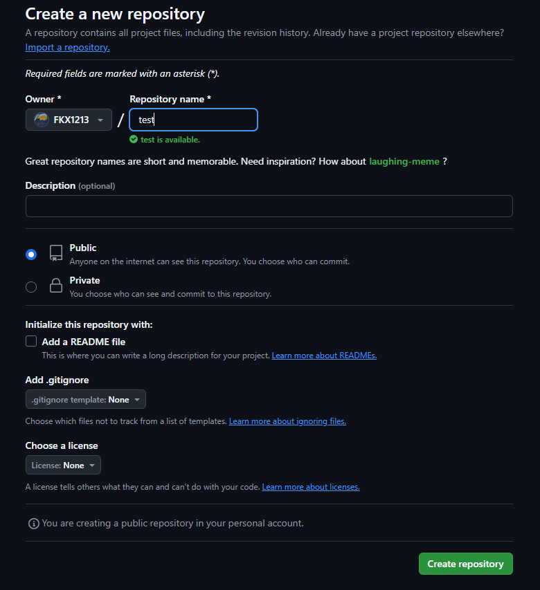
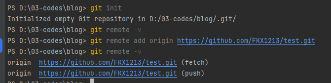
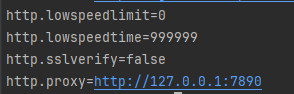

# Github托管博客

## 1.前置条件

科学上网❗❗❗需要 github 的账号，在 github 中创建一个仓库，用于对应 




## 2.创建连接

在项目中创建一个文件 `.gitignore` 放入根目录下：

```.gitignore
node_modules
.DS_Store
dist
dist-ssr
cache
.cache
.temp
*.local
```

在终端控制台中，输入：

```shell
# 初始化仓库，交给 git 托管
git init
# 查看是否已经关联过远端的分支
 git remote -v
# 开始关联
git remote add origin https://github.com/FKX1213/test.git
```




## 3.推送

### 3.1.commit


### 3.2.push


至此，push 成功。


## 4.github遇到的问题

在使用过程中，我遇到了很多 github 相关的问题，大部分是由于科学上网，网络连接不顺畅。

- push 失败，connect 超时

参考了一些大神写的博客，我首先是修改了 hosts 的配置文件：

```
C:\Windows\System32\drivers\etc
```

在 `hosts` 文件中，加入ip映射：

```txt:line-numbers
#github IP地址
199.232.69.194 github.global.ssl.fastly.net
140.82.113.3 github.com
140.82.112.4 www.github.com
185.199.108.153 assets-cdn.github.com
185.199.109.153 assets-cdn.github.com
185.199.110.153 assets-cdn.github.com
185.199.111.153 assets-cdn.github.com
185.199.108.153 documentcloud.github.com
185.199.109.153 documentcloud.github.com
185.199.110.153 documentcloud.github.com
185.199.111.153 documentcloud.github.com
140.82.114.3 gist.github.com
185.199.108.153 help.github.com
185.199.109.153 help.github.com
185.199.110.153 help.github.com
185.199.111.153 help.github.com
140.82.112.9 nodeload.github.com
199.232.68.133 raw.github.com
140.82.112.18 status.github.com
140.82.113.18 training.github.com
199.232.68.133 raw.githubusercontent.com
199.232.68.133 user-images.githubusercontent.com
199.232.68.133 avatars1.githubusercontent.com
199.232.68.133 avatars2.githubusercontent.com
199.232.68.133 avatars3.githubusercontent.com
199.232.68.133 cloud.githubusercontent.com
140.82.113.6 api.github.com
```


但是，还是解决不了问题，然后阅读了这篇文章，[完美解决 git报错fatal: unable to access ‘https://github.com/.../.git‘:Recv failure Connection was reset_git recv failure: connection was reset-CSDN博客](https://blog.csdn.net/m0_63230155/article/details/132070860?spm=1001.2014.3001.5506)

修改 git 的配置文件：

```shell
# 查看 git 全局的配置
git config --global -l
```



之后，就可以正常使用了。