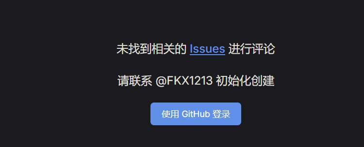

# 引入gittalk功能

应一位朋友的邀请，引入gittalk功能，可以进行互动。撸起袖子加油干，不会就学。

## 1.注册应用

进入Github，进入个人设置Settings，最下方Developer settings，点击：OAuth Apps，点击：New OAuth App


创建一个，此刻获取到clientID和clientSecret

## 安装依赖

在博客的终端控制台，输入命令：
```shell
npm install md5 gitalk
```


## 新增配置

新增 `.vitepress/components/gitalk.vue` ，默认gitalk存在黑色模式下字体白色，背景色也是白色，导致看不见字体，所以样式里设置一下：

```vue:line-numbers
<template>
  <div class="gitalk-container">
    <div id="gitalk-container"></div>
  </div>
</template>
<script>
import md5 from "md5"
import Gitalk from "gitalk"
import "gitalk/dist/gitalk.css"

export default {
  name: "gitalk",
  data() {
    return {}
  },
  mounted() {
    const commentConfig = {
      clientID: "你的clientID",
      clientSecret: "你的clientSecret",
      repo: "github仓库名", // 用于存放评论，可以新建一个
      owner: "名称",
      admin: ["名称"],
      id: md5(location.pathname),
      distractionFreeMode: false,
    }
    const gitalk = new Gitalk(commentConfig)
    gitalk.render("gitalk-container")
  },
}
</script>
<style>
.gt-container .gt-header-textarea {
  color: #000;
}
</style>
```

编辑 `.vitepress/theme/index.ts`

```ts
import DefaultTheme from 'vitepress/theme';
import './custom.css';
// @ts-ignore
import comment from "../components/gitalk.vue";// 引入这一段

export default {
  ...DefaultTheme,
  enhanceApp(ctx) {
    DefaultTheme.enhanceApp(ctx)
    ctx.app.component("gitalk", comment)// 引入这一段
  },
};
```

## 使用：

在需要的Markdown里使用 `<git-talk />` 开启评论

## 评论仓库的问题

由于我只是在 github 上创建了一个仓库，并没有初始化，也没有开启 issue ，导致出现：



需要去对应的 issue 存放仓库，进行如下操作：
- 进入仓库
- settings
- 滑到 features
- 


<git-talk />