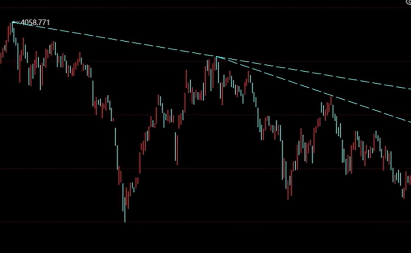
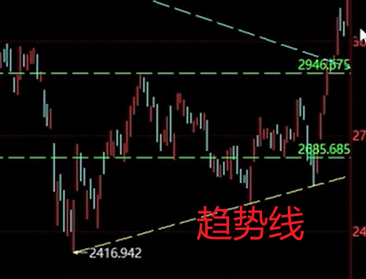

# 股票基础常识

::: details 学习资料：

- [新手小白炒股入门基础知识讲解](https://www.bilibili.com/video/BV1EuxTe3EB6)
- [从零构建交易系统](https://www.bilibili.com/video/BV13k2fYGEN9)

:::

新手小白，勇闯股市：

[[toc]]

## 1.基础常识

股票是一种有价证券，是股份公司在筹集资本时向出资人发行的**股份凭证**，代表着**持有者对股份公司的所有权**
。股东通过公司成长或交易市场波动带来的利润；
但也要共同承担公司运行错误带来的风险。每一支股票背后都有一家上市公司。

股票的分类：

- A股：中国境内发行，只供境内机构、组织或个人（不含港澳台投资者）以人民币认购和交易的普通股股票
- B股：中国大陆注册、上市的特种股票，以人名币标明面值，只能以外币认购和交易
- 港股（H股）：在香港（Hong Kong）上市的股票
- 美股：在美国证券交易所上市的股票

:::danger
以下的内容都是针对A股
:::

### 1.1.股票代码

股票市场有：

- 上海证券交易所
    - 600、601、603、605，主板股票
    - 688，科创板股票
- 深圳证券交易所
    - 000、002、003，主板股票
    - 300、301，创业板股票
- 北京证券交易所
    - 43、83、87、88，新三板转到北交所的股票
    - 基础层43、创新层83、精选层87、新上北交所88

要想购买A股的股票，还得分权限呢，作为新手只能购买上交所和深交所主板股票（00、60）

进阶权限：

- 3开头的创业板，两年交易经验+月均10万资产
- 68开头的科创板，两年交易经验+月均50万资产
- 8开头的北交所，两年交易经验+月均50万资产，创新层100万

### 1.2.交易时间

A股的交易时间，是每周一到周五，法定节假日除外：

- 盘前集合竞价时间：
    - 盘前：9:15——9:25，25分开出开盘价
    - 15——20分，可挂单可撤单，20——25可挂单不可撤单
- 盘中连续交易时间：
    - 上午，9:30——11:30
    - 下午，13:00——14:57
- 尾盘集合竞价时间
    - 尾盘，14:57——15:00开出收盘价，可挂单不可撤单
- 盘后交易时间
    - 沪市、深市主板15点后没有盘后交易
    - 创业板和科创版有盘后15:05——15:30有以收盘价成交的交易时间

### 1.3.交易规则

股票最少买入一手（100股），或者是其整数倍。股票最后一次卖出不可低于100股的零散数量。

股票是当天买入，下一个交易日在可以卖出（T+1）。资金清算是按照（T+1），股票卖出后，资金马上到股票账户，当天可继续使用但是不可以转出，下一个交易日9：00后才可以转出至银行卡（需考虑周末、节假日）。

挂单并不是想买就能买，挂单成交的原则是按照价格优先、时间优先。连续竞价时，价格在涨跌幅区间内有效，委托当天有效。委托的技巧：涨停价买入，跌停价卖出，都会以实时价成交。

涨跌幅限制：

- 主板股票，上一交易日收盘价的 ±10%
- 科创板、创业板，上一交易日收盘价的 ±20%

## 2.构建自己的交易系统

预测不了市场，就打算做趋势，做趋势需要了解趋势走向，找到关键位置入场，包括入场的份额，制定相应的策略，止亏。

策略就是：

- 先看大盘趋势
    - 上证指数、同花顺全A（沪深）
    - 找关键位
- 板块趋势
    - 找板块
    - 关键位
- 选个股
    - 看趋势
    - 关键位

### 2.1.趋势线

趋势，高点抬高就是上行，如果高点降低就是下行。画趋势线的时候，需要把所有日K都囊括在趋势线的同一侧

找到趋势后，就是需要判断关键位，比如，最后一段为 W 型，在震荡中，就可以将震荡的高点设置为关键位：

设置为关键位置，就需要立马去找到止损（-10%），到达止损位置，就走❗❗❗

如果没有遇到止损位，就可以按照日K的低价守住趋势线，趋势线被破，就离场。

做趋势不预测，什么时候突破关键位，什么时候Buy。

