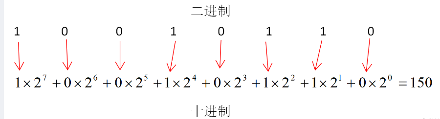
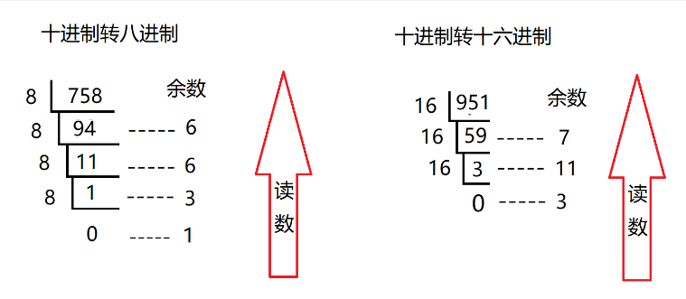

# 软考初级程序员

## 1.计算机组成与体系结构

### 1.1.进制的转换

进制的表示：

| 分类                  | 示例               | 含义    |
|---------------------|------------------|-------|
| 二进制（B，binary）       | 0100110          | 逢2进1  |
| 八进制（O，octonary）     | 01234567         | 逢8进1  |
| 十进制（D，decimalism）   | 9876543210       | 逢10进1 |
| 十六进制（H，hexadecimal） | 0123456789ABCDEF | 逢16进1 |

计算机中的一切数据，如数字、汉字、图片、声音、视频、指令等都是使用二进制进行表示和传输的。

ASCII：美国信息交换标准代码。一般使用**7位二进制数字**表示字母、数字、标点符号及部分的特殊控制字符，共 128 种。

其它进制进制转成十进制采用按权展开法：

十进制转成其它进制采用短除法：

